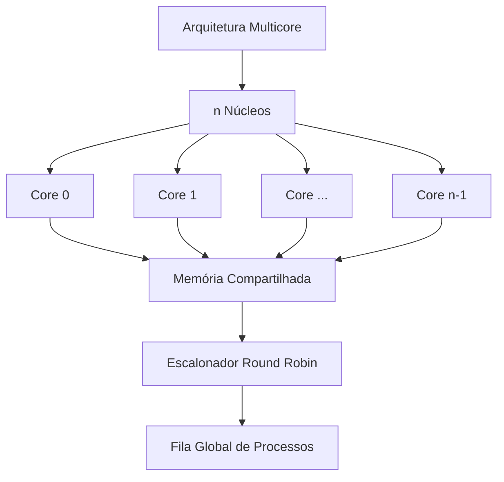

# Introdução ao Trabalho Final

## 📋 Especificação Completa

### Título
**Simulação de Arquitetura Multicore com Gerenciamento de Memória e Escalonamento de Processos**

### Informações Gerais
- **Instituição:** Centro Federal de Educação Tecnológica de Minas Gerais (CEFET-MG)
- **Disciplina:** Sistemas Operacionais
- **Professor:** Michel Pires da Silva
- **Data de Entrega:** 06/12/2025
- **Equipe:** 4 alunos
- **Valor Total:** 30 pontos

### Distribuição de Pontos
| Componente | Pontos | Descrição |
|------------|--------|-----------|
| **Escalonamento** | 10 | Implementação do Round Robin multicore |
| **Gerência de Memória** | 10 | Segmentação e políticas de substituição |
| **Artigo Científico** | 10 | Formato IEEE com análises |
| **TOTAL** | **30** | |

## 🎯 Objetivo do Trabalho

Consolidar conhecimentos sobre:

1. **Arquiteturas Computacionais Modernas**
   - Processamento multicore
   - Pipeline MIPS
   - Hierarquia de memória

2. **Gerenciamento de Processos**
   - Escalonamento Round Robin
   - Context switching
   - Sincronização entre núcleos

3. **Gerenciamento de Memória**
   - Segmentação de memória
   - Políticas de substituição (FIFO, LRU)
   - Mapeamento de endereços

4. **Análise de Desempenho**
   - Métricas comparativas
   - Baseline vs multicore
   - Eficiência de escalonamento

## 🔄 Evolução do Projeto

### Trabalho Anterior (Base)


**Características:**
- ✅ 1 núcleo de processamento
- ✅ Pipeline MIPS completo
- ✅ Cache L1 + RAM + Disco
- ✅ PCB básico
- ✅ Escalonador simples

### Trabalho Atual (Expansão)


**Novidades:**
- 🆕 Múltiplos núcleos de processamento
- 🆕 Escalonador Round Robin multicore
- 🆕 Memória compartilhada entre núcleos
- 🆕 Segmentação de memória
- 🆕 Políticas de substituição avançadas
- 🆕 Métricas comparativas detalhadas

## 📊 Cenários de Teste

O simulador deve ser avaliado em **2 cenários**:

### 1️⃣ Cenário Não-Preemptivo
```cpp
// Cada processo executa até conclusão
while (!all_processes_finished) {
    Process* p = scheduler.get_next();
    p->run_to_completion();  // Sem interrupções
}
```

**Características:**
- Processos executam até o fim
- Sem interrupção por quantum
- Ordem determinada pelo escalonador
- Simplificado para comparação

### 2️⃣ Cenário Preemptivo (FOCO DO ROUND ROBIN)
```cpp
// Processos compartilham CPU com quantum
while (!all_processes_finished) {
    Process* p = scheduler.get_next();
    p->run_with_quantum(QUANTUM);  // Interrupção permitida
    
    if (!p->is_finished()) {
        scheduler.requeue(p);  // Volta para fila
    }
}
```

**Características:**
- ⏱️ Quantum de tempo definido
- 🔄 Processos podem ser interrompidos
- 💾 Context switch salva/restaura estado
- 📊 Fairness entre processos

## 🏗️ Arquitetura Proposta

### Visão Geral
```
┌─────────────────────────────────────────────────────────┐
│                   SIMULADOR MULTICORE                    │
├─────────────────────────────────────────────────────────┤
│                                                           │
│  ┌─────────┐  ┌─────────┐  ┌─────────┐  ┌─────────┐   │
│  │ Core 0  │  │ Core 1  │  │ Core 2  │  │ Core n  │   │
│  │ ┌─────┐ │  │ ┌─────┐ │  │ ┌─────┐ │  │ ┌─────┐ │   │
│  │ │Cache│ │  │ │Cache│ │  │ │Cache│ │  │ │Cache│ │   │
│  │ └─────┘ │  │ └─────┘ │  │ └─────┘ │  │ └─────┘ │   │
│  └────┬────┘  └────┬────┘  └────┬────┘  └────┬────┘   │
│       └───────────┬─────────────┬───────────┬─┘        │
│                   │   Barramento │           │          │
│       ┌───────────▼─────────────▼───────────▼─┐        │
│       │      MEMÓRIA PRINCIPAL (RAM)          │        │
│       └───────────────┬───────────────────────┘        │
│                       │                                 │
│       ┌───────────────▼───────────────────────┐        │
│       │    MEMÓRIA SECUNDÁRIA (DISCO)         │        │
│       └───────────────────────────────────────┘        │
│                                                         │
│  ┌───────────────────────────────────────────────────┐ │
│  │         ESCALONADOR ROUND ROBIN                   │ │
│  │  ┌─────────────────────────────────────────────┐  │ │
│  │  │  Fila de Prontos │ P1 │ P2 │ P3 │ P4 │...  │  │ │
│  │  └─────────────────────────────────────────────┘  │ │
│  └───────────────────────────────────────────────────┘ │
└─────────────────────────────────────────────────────────┘
```

### Componentes Principais

#### 1. **Núcleos de Processamento (Cores)**
- Cada núcleo possui:
  - Pipeline MIPS completo (IF, ID, EX, MEM, WB)
  - Cache L1 privada
  - Banco de registradores próprio
  - ULA independente

#### 2. **Memória Compartilhada**
- **RAM:** Compartilhada entre todos os núcleos
- **Disco:** Armazenamento secundário unificado
- **Sincronização:** Acesso controlado (mutexes)

#### 3. **Escalonador Round Robin**
- Fila global de processos prontos
- Quantum de tempo configurável
- Distribuição justa entre núcleos

## 📏 Modelo de Memória (Tanenbaum)

### Endereçamento de Memória

Segundo Tanenbaum, a memória é acessada por **palavras de x bits**:

```
┌─────────────────────────────────────┐
│     Endereço de Memória (32 bits)   │
├─────────────────┬───────────────────┤
│  Endereço Bloco │   Deslocamento    │
│   (bits 31-k)   │   (bits k-1 a 0)  │
└─────────────────┴───────────────────┘
```

**Exemplo:** Palavra de 32 bits (4 bytes)
- Se k = 2 → 4 bytes por bloco
- Bits 31-2: endereço do bloco
- Bits 1-0: deslocamento interno

### Segmentação

```cpp
struct Segment {
    uint32_t base_address;    // Início do segmento
    uint32_t limit;           // Tamanho do segmento
    uint32_t permissions;     // R/W/X
};

// Tradução de endereço lógico para físico
uint32_t translate(uint32_t logical_addr, Segment seg) {
    if (logical_addr >= seg.limit) {
        throw SegmentationFault();
    }
    return seg.base_address + logical_addr;
}
```

## 🎓 Conceitos Fundamentais

### Round Robin

**Definição:** Algoritmo de escalonamento que aloca CPU ciclicamente por quantum.

**Características:**
- ⏱️ **Quantum (q):** Fatia de tempo fixa
- 🔄 **Circular:** Fila FIFO circular
- ⚖️ **Fair:** Todos processos recebem tempo igual
- 🚫 **Preemptivo:** Força troca de contexto

**Pseudocódigo:**
```python
def round_robin(ready_queue, quantum):
    while not ready_queue.empty():
        process = ready_queue.dequeue()
        
        # Executa por no máximo 'quantum' unidades
        execution_time = min(quantum, process.remaining_time)
        process.execute(execution_time)
        
        # Se não terminou, volta para fila
        if process.remaining_time > 0:
            ready_queue.enqueue(process)
        else:
            process.state = FINISHED
```

### Context Switch

Troca de contexto entre processos:

```cpp
void context_switch(PCB* old_process, PCB* new_process, Core& core) {
    // 1. Salvar estado do processo antigo
    old_process->regBank = core.registers;
    old_process->pc = core.registers.pc.read();
    
    // 2. Restaurar estado do novo processo
    core.registers = new_process->regBank;
    core.registers.pc.write(new_process->pc);
    
    // 3. Atualizar métricas
    old_process->context_switches++;
    new_process->context_switches++;
}
```

## 📊 Métricas Obrigatórias

O simulador deve coletar:

### Por Processo
| Métrica | Descrição | Fórmula |
|---------|-----------|---------|
| **Tempo de Espera** | Tempo na fila de prontos | $T_{espera} = T_{retorno} - T_{execução}$ |
| **Tempo de Retorno** | Tempo total no sistema | $T_{retorno} = T_{fim} - T_{chegada}$ |
| **Ciclos de CPU** | Ciclos executando | Contador incremental |
| **Context Switches** | Trocas de contexto | Contador incremental |

### Global do Sistema
| Métrica | Descrição | Fórmula |
|---------|-----------|---------|
| **Tempo Médio de Espera** | Média de $T_{espera}$ | $\frac{\sum T_{espera}}{n}$ |
| **Throughput** | Processos por unidade tempo | $\frac{n_{processos}}{T_{total}}$ |
| **Utilização CPU** | % tempo CPU ocupada | $\frac{T_{ocupado}}{T_{total}} \times 100$ |
| **Speedup** | Ganho com multicore | $\frac{T_{single}}{T_{multi}}$ |

## 🎯 Critérios de Avaliação

### Implementação (20 pontos)

#### Escalonamento (10 pontos)
- [ ] Round Robin implementado corretamente (3 pts)
- [ ] Context switch funcional (2 pts)
- [ ] Quantum configurável (1 pt)
- [ ] Distribuição entre múltiplos núcleos (2 pts)
- [ ] Sincronização adequada (2 pts)

#### Gerência de Memória (10 pontos)
- [ ] Segmentação implementada (3 pts)
- [ ] Tradução de endereços (2 pts)
- [ ] Política de substituição (FIFO ou LRU) (3 pts)
- [ ] Tratamento de faltas de página (2 pts)

### Artigo Científico (10 pontos)
- [ ] Formato IEEE correto (2 pts)
- [ ] Fundamentação teórica (2 pts)
- [ ] Metodologia clara (2 pts)
- [ ] Resultados e análises (3 pts)
- [ ] Conclusões e trabalhos futuros (1 pt)

## 🚫 Restrições Importantes

> **⚠️ ATENÇÃO:** Leia com cuidado!

### Proibições
1. ❌ **Entrada dinâmica de processos:** Todos processos devem ser carregados no início
2. ❌ **Modificar o modelo MIPS:** Pipeline deve permanecer compatível
3. ❌ **Simplificar demais:** Implementação deve ser realista

### Obrigatoriedades
1. ✅ **Código público no GitHub**
2. ✅ **Instruções de compilação no README**
3. ✅ **Artigo no template IEEE oficial**
4. ✅ **Comparação com baseline single-core**

## 🗓️ Prazos

| Data | Marco |
|------|-------|
| **Hoje** | Início do desenvolvimento |
| **20/11/2025** | Checkpoint 1: Multicore básico |
| **27/11/2025** | Checkpoint 2: Escalonador funcional |
| **04/12/2025** | Checkpoint 3: Testes completos |
| **06/12/2025** | **ENTREGA FINAL** |

<div class="alert alert-danger">
<strong>DEADLINE RÍGIDO:</strong> 06/12/2025 - Não haverá prorrogação!
</div>

## 📖 Próximos Passos

Agora que você entende o trabalho, vamos aos requisitos detalhados:

➡️ [**Requisitos Detalhados do Trabalho**](02-requisitos.md)

---

## 📚 Referências Desta Seção

1. **Especificação do Trabalho** - Prof. Michel Pires
2. **Modern Operating Systems** - Andrew S. Tanenbaum
3. **Computer Organization and Design** - Patterson & Hennessy

