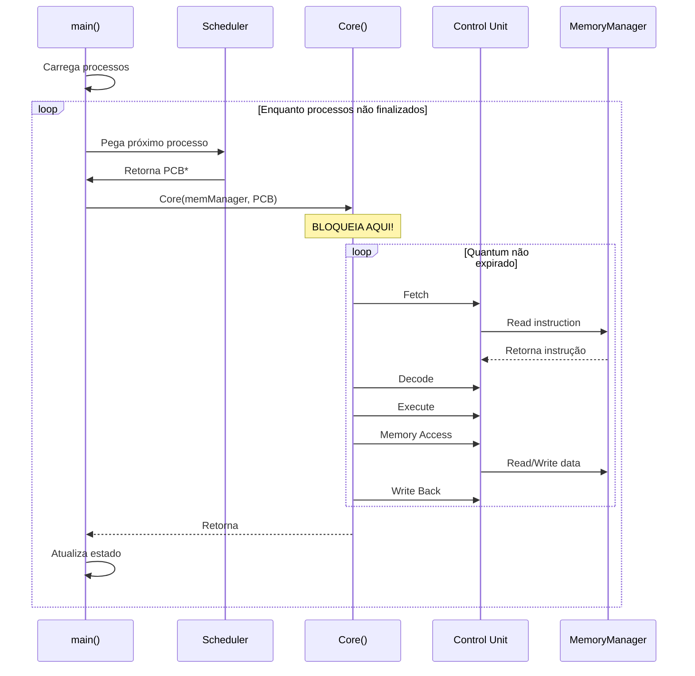

# Arquitetura Atual do Simulador

## 🔍 Análise Completa do Código Base

Esta seção examina em detalhes a implementação atual para entender o que já existe e o que precisa ser modificado.

## 📁 Estrutura de Diretórios

```
SO-SimuladorVonNeumann/
├── src/
│   ├── main.cpp                    # ⭐ Loop principal single-core
│   ├── cpu/
│   │   ├── CONTROL_UNIT.cpp/hpp    # ⭐ Pipeline MIPS
│   │   ├── PCB.hpp                 # ⭐ Process Control Block
│   │   ├── REGISTER_BANK.cpp/hpp   # Registradores MIPS
│   │   ├── ULA.cpp/hpp             # ALU
│   │   ├── HASH_REGISTER.hpp       # Mapeamento de registradores
│   │   ├── pcb_loader.cpp/hpp      # Carregamento de PCB
│   │   └── instruction_codes.hpp   # Códigos de instrução
│   ├── memory/
│   │   ├── MemoryManager.cpp/hpp   # ⭐ Gerenciador unificado
│   │   ├── MAIN_MEMORY.cpp/hpp     # RAM
│   │   ├── SECONDARY_MEMORY.cpp/hpp# Disco
│   │   ├── cache.cpp/hpp           # ⭐ Cache L1
│   │   └── cachePolicy.cpp/hpp     # Política FIFO
│   ├── IO/
│   │   ├── IOManager.cpp/hpp       # ⭐ Gerenciamento I/O
│   │   └── README.md
│   └── parser_json/
│       ├── parser_json.cpp/hpp     # Parser de programas
│       └── ...
├── CMakeLists.txt                  # Build configuration
├── process1.json                   # Exemplo de PCB
└── src/tasks/tasks.json           # Exemplo de programa
```

**Legenda:**
- ⭐ = Arquivos que precisarão ser modificados

## 🏗️ Componentes Existentes

### 1. main.cpp - Loop Principal Atual

**Estrutura Atual:**
```cpp
int main() {
    // 1. Inicialização
    MemoryManager memManager(1024, 8192);
    IOManager ioManager;
    
    // 2. Carregamento de processos
    std::vector<std::unique_ptr<PCB>> process_list;
    std::deque<PCB*> ready_queue;
    
    auto p1 = std::make_unique<PCB>();
    load_pcb_from_json("process1.json", *p1);
    loadJsonProgram("tasks.json", memManager, *p1, 0);
    process_list.push_back(std::move(p1));
    
    // 3. Loop do escalonador (SINGLE-CORE)
    while (finished_processes < total_processes) {
        // Verifica bloqueados
        for (auto it = blocked_list.begin(); 
             it != blocked_list.end(); ) {
            if ((*it)->state == State::Ready) {
                ready_queue.push_back(*it);
                it = blocked_list.erase(it);
            } else ++it;
        }
        
        // Pega próximo processo
        PCB* current_process = ready_queue.front();
        ready_queue.pop_front();
        
        // Executa (AQUI É ONDE PRECISAMOS MUDAR!)
        Core(memManager, *current_process, &io_requests, print_lock);
        
        // Trata estado pós-execução
        switch (current_process->state) {
            case State::Blocked:
                ioManager.registerProcessWaitingForIO(current_process);
                blocked_list.push_back(current_process);
                break;
            case State::Finished:
                print_metrics(*current_process);
                finished_processes++;
                break;
            default:  // Quantum expirou
                ready_queue.push_back(current_process);
                break;
        }
    }
    
    return 0;
}
```

**Análise:**
- ✅ Já tem Round Robin básico
- ✅ Quantum por processo (em PCB)
- ✅ Context switch implícito
- ❌ **Single-core** - executa 1 processo por vez
- ❌ Não usa threads
- ❌ Não tem múltiplos núcleos

**O que mudar:**
```cpp
// ANTES (single-core):
Core(memManager, *current_process, ...);  // Bloqueia aqui

// DEPOIS (multicore):
cores[next_free_core].execute_async(current_process);  // Não bloqueia
```

### 2. CONTROL_UNIT.cpp - Função Core()

**Função Core Atual:**
```cpp
void* Core(MemoryManager &memoryManager, 
           PCB &process, 
           vector<unique_ptr<IORequest>>* ioRequests, 
           bool &printLock) 
{
    Control_Unit control_unit;
    int counter = 0;
    int counterForEnd = 0;
    bool endProgram = false;
    bool endExecution = false;
    
    ControlContext context = {
        .registers = process.regBank,
        .memManager = memoryManager,
        .ioRequests = *ioRequests,
        .printLock = printLock,
        .process = process,
        .counter = counter,
        .counterForEnd = counterForEnd,
        .endProgram = endProgram,
        .endExecution = endExecution
    };
    
    // Loop de execução do processo
    int cycles_in_quantum = 0;
    
    while (!endProgram && !endExecution && 
           cycles_in_quantum < process.quantum) {
        
        Instruction_Data data;
        
        // Pipeline MIPS de 5 estágios
        control_unit.Fetch(context);
        if (endProgram) break;
        
        control_unit.Decode(context.registers, data);
        control_unit.Execute(data, context);
        control_unit.Memory_Acess(data, context);
        control_unit.Write_Back(data, context);
        
        cycles_in_quantum++;
        account_pipeline_cycle(process);
    }
    
    // Atualiza estado do processo
    if (endProgram) {
        process.state = State::Finished;
    } else if (has_io_request) {
        process.state = State::Blocked;
    } else {
        process.state = State::Ready;  // Quantum expirou
    }
    
    return nullptr;
}
```

**Análise:**
- ✅ Pipeline MIPS completo
- ✅ Respeita quantum do processo
- ✅ Atualiza métricas (ciclos, acessos, etc.)
- ✅ Trata fim de programa e I/O
- ❌ Retorna `void*` (preparado para thread, mas não usa)
- ❌ Execução síncrona (bloqueia até terminar)

**O que mudar:**
- Executar em thread separada
- Adicionar sincronização (mutexes)
- Controlar acesso à memória compartilhada

### 3. PCB.hpp - Process Control Block

**Estrutura Atual:**
```cpp
enum class State {
    Ready,
    Running,
    Blocked,
    Finished
};

struct MemWeights {
    uint64_t cache = 1;
    uint64_t primary = 5;
    uint64_t secondary = 10;
};

struct PCB {
    // Identificação
    int pid = 0;
    std::string name;
    int quantum = 0;
    int priority = 0;
    
    // Estado
    State state = State::Ready;
    hw::REGISTER_BANK regBank;
    
    // Métricas de memória
    std::atomic<uint64_t> primary_mem_accesses{0};
    std::atomic<uint64_t> secondary_mem_accesses{0};
    std::atomic<uint64_t> memory_cycles{0};
    std::atomic<uint64_t> cache_mem_accesses{0};
    std::atomic<uint64_t> mem_accesses_total{0};
    
    // Métricas de pipeline
    std::atomic<uint64_t> pipeline_cycles{0};
    std::atomic<uint64_t> stage_invocations{0};
    std::atomic<uint64_t> mem_reads{0};
    std::atomic<uint64_t> mem_writes{0};
    
    // Métricas de cache
    std::atomic<uint64_t> cache_hits{0};
    std::atomic<uint64_t> cache_misses{0};
    
    // I/O
    std::atomic<uint64_t> io_cycles{1};
    
    MemWeights memWeights;
};
```

**Análise:**
- ✅ Já usa `std::atomic` (thread-safe!)
- ✅ Tem quantum configurável
- ✅ Banco de registradores completo
- ✅ Métricas detalhadas
- ❌ Falta métricas de escalonamento

**O que adicionar:**
```cpp
struct PCB {
    // ... campos existentes ...
    
    // NOVOS: Métricas de escalonamento
    std::atomic<uint64_t> arrival_time{0};      // Quando chegou
    std::atomic<uint64_t> start_time{0};        // Primeira execução
    std::atomic<uint64_t> finish_time{0};       // Quando terminou
    std::atomic<uint64_t> wait_time{0};         // Tempo em ready
    std::atomic<uint64_t> context_switches{0};  // Trocas de contexto
    std::atomic<int> assigned_core{-1};         // Núcleo atual
    std::atomic<int> last_core{-1};             // Último núcleo
    
    // Para segmentação de memória
    uint32_t segment_base{0};
    uint32_t segment_limit{0};
};
```

### 4. MemoryManager - Gerenciador de Memória

**Implementação Atual:**
```cpp
class MemoryManager {
public:
    MemoryManager(size_t mainMemorySize, size_t secondaryMemorySize);
    
    uint32_t read(uint32_t address, PCB& process);
    void write(uint32_t address, uint32_t data, PCB& process);
    void writeToFile(uint32_t address, uint32_t data);
    
private:
    std::unique_ptr<MAIN_MEMORY> mainMemory;
    std::unique_ptr<SECONDARY_MEMORY> secondaryMemory;
    std::unique_ptr<Cache> L1_cache;
    
    size_t mainMemoryLimit;
};
```

**Fluxo de Leitura Atual:**
```cpp
uint32_t MemoryManager::read(uint32_t address, PCB& process) {
    // 1. Tenta cache L1
    size_t data = L1_cache->get(address);
    
    if (data != CACHE_MISS) {
        process.cache_hits++;
        process.cache_mem_accesses++;
        process.memory_cycles += process.memWeights.cache;
        return static_cast<uint32_t>(data);
    }
    
    // 2. Cache miss → RAM
    process.cache_misses++;
    uint32_t value;
    
    if (address < mainMemoryLimit) {
        value = mainMemory->ReadMem(address);
        process.primary_mem_accesses++;
        process.memory_cycles += process.memWeights.primary;
    } else {
        // 3. Não está na RAM → Disco
        value = secondaryMemory->ReadMem(address - mainMemoryLimit);
        process.secondary_mem_accesses++;
        process.memory_cycles += process.memWeights.secondary;
    }
    
    // 4. Atualiza cache
    L1_cache->put(address, value, this);
    
    return value;
}
```

**Análise:**
- ✅ Hierarquia de 3 níveis (Cache, RAM, Disco)
- ✅ Métricas detalhadas
- ✅ Write-back na cache
- ❌ **NÃO thread-safe!**
- ❌ Cache L1 compartilhada (deveria ser privada)

**O que mudar:**
```cpp
class MemoryManager {
private:
    // RAM e Disco compartilhados
    std::unique_ptr<MAIN_MEMORY> mainMemory;
    std::unique_ptr<SECONDARY_MEMORY> secondaryMemory;
    
    // NOVO: Mutex para sincronização
    std::mutex memory_mutex;
    
    // REMOVIDO: Cache L1 (vai para cada núcleo)
    // std::unique_ptr<Cache> L1_cache;
    
public:
    uint32_t read(uint32_t address, PCB& process) {
        std::lock_guard<std::mutex> lock(memory_mutex);
        // ... leitura thread-safe ...
    }
};

// Cache L1 vai para classe Core
class Core {
    int core_id;
    std::unique_ptr<Cache> L1_cache;  // Privada!
    // ...
};
```

### 5. Cache - Política FIFO

**Implementação Atual:**
```cpp
class Cache {
private:
    std::unordered_map<size_t, CacheEntry> cache_map;
    std::queue<size_t> fifo_queue;
    size_t capacity;
    size_t cache_hits;
    size_t cache_misses;
    
public:
    size_t get(size_t address) {
        auto it = cache_map.find(address);
        
        if (it != cache_map.end() && it->second.isValid) {
            cache_hits++;
            return it->second.data;
        }
        
        cache_misses++;
        return CACHE_MISS;
    }
    
    void put(size_t address, size_t data, MemoryManager* memManager) {
        if (cache_map.size() >= capacity) {
            // Política FIFO
            size_t victim = fifo_queue.front();
            fifo_queue.pop();
            
            // Write-back se dirty
            if (cache_map[victim].isDirty) {
                memManager->writeToFile(victim, cache_map[victim].data);
            }
            
            cache_map.erase(victim);
        }
        
        cache_map[address] = {data, true, false};
        fifo_queue.push(address);
    }
};
```

**Análise:**
- ✅ FIFO implementado
- ✅ Write-back funcional
- ✅ Bits isValid e isDirty
- ✅ Fácil trocar por LRU
- ❌ Métricas globais (não por processo)

**LRU Alternativo (para implementar):**
```cpp
class LRUCache {
private:
    std::list<size_t> lru_list;  // Mais recente no início
    std::unordered_map<size_t, 
        std::pair<CacheEntry, std::list<size_t>::iterator>> cache_map;
    
public:
    void put(size_t address, size_t data, MemoryManager* mm) {
        auto it = cache_map.find(address);
        
        if (it != cache_map.end()) {
            // Move para início (mais recente)
            lru_list.erase(it->second.second);
        } else if (cache_map.size() >= capacity) {
            // Remove menos recente (final da lista)
            size_t victim = lru_list.back();
            lru_list.pop_back();
            
            if (cache_map[victim].first.isDirty) {
                mm->writeToFile(victim, cache_map[victim].first.data);
            }
            
            cache_map.erase(victim);
        }
        
        lru_list.push_front(address);
        cache_map[address] = {{data, true, false}, lru_list.begin()};
    }
};
```

### 6. IOManager - Gerenciamento de I/O

**Implementação Atual:**
```cpp
class IOManager {
private:
    std::deque<PCB*> waiting_processes;
    std::mutex queue_mutex;
    std::thread manager_thread;
    std::atomic<bool> running{true};
    
public:
    void registerProcessWaitingForIO(PCB* process) {
        std::lock_guard<std::mutex> lock(queue_mutex);
        process->state = State::Blocked;
        waiting_processes.push_back(process);
    }
    
private:
    void managerLoop() {
        while (running) {
            // Simula dispositivos
            simulateDevices();
            
            // Combina processos com dispositivos
            matchProcessesToDevices();
            
            // Processa requisições
            processIORequests();
            
            std::this_thread::sleep_for(std::chrono::milliseconds(10));
        }
    }
};
```

**Análise:**
- ✅ Thread separada para I/O
- ✅ Thread-safe
- ✅ Desbloqueia processos automaticamente
- ✅ Funciona bem com multicore
- ✅ **Não precisa mudar!**

## 🔄 Fluxo de Execução Atual



**Problema:** `Core()` é **síncrono** - main() espera terminar.

## 📊 Métricas Atuais Coletadas

### Por Processo (PCB)
| Métrica | Variável | Tipo |
|---------|----------|------|
| Ciclos de Pipeline | `pipeline_cycles` | atomic<uint64_t> |
| Acessos à RAM | `primary_mem_accesses` | atomic<uint64_t> |
| Acessos ao Disco | `secondary_mem_accesses` | atomic<uint64_t> |
| Cache Hits | `cache_hits` | atomic<uint64_t> |
| Cache Misses | `cache_misses` | atomic<uint64_t> |
| Leituras de Memória | `mem_reads` | atomic<uint64_t> |
| Escritas de Memória | `mem_writes` | atomic<uint64_t> |
| Ciclos de Memória | `memory_cycles` | atomic<uint64_t> |
| Ciclos de I/O | `io_cycles` | atomic<uint64_t> |

### Globais (Calculadas)
- Tempo médio de espera
- Throughput
- Utilização de CPU

**Faltam:**
- ❌ Tempo de chegada/início/fim
- ❌ Context switches
- ❌ Migrações entre núcleos
- ❌ Utilização por núcleo

## 🎯 Resumo: O Que Temos vs O Que Precisamos

### ✅ O Que Já Funciona
1. **Pipeline MIPS completo** - IF, ID, EX, MEM, WB
2. **Hierarquia de memória** - Cache, RAM, Disco
3. **PCB com métricas** - Já usa atomic
4. **Round Robin básico** - Quantum respeitado
5. **I/O assíncrono** - Thread separada
6. **Parser JSON** - Carregamento de programas

### ❌ O Que Precisa Ser Implementado
1. **Múltiplos núcleos** - Criar classe `Core`
2. **Execução paralela** - Threads por núcleo
3. **Sincronização** - Mutexes para memória
4. **Cache privada** - Uma por núcleo
5. **Métricas expandidas** - Escalonamento
6. **Segmentação** - Tabela de segmentos
7. **Comparação baseline** - Single vs Multi

## 📐 Diagrama da Arquitetura Atual

```
┌─────────────────────────────────────────┐
│           main()                         │
│  ┌───────────────────────────────────┐  │
│  │  Scheduler (Round Robin)          │  │
│  │  - ready_queue (deque<PCB*>)      │  │
│  │  - blocked_list                   │  │
│  └───────────┬───────────────────────┘  │
│              │                           │
│              ▼                           │
│  ┌───────────────────────────────────┐  │
│  │  Core() - FUNÇÃO SÍNCRONA         │  │
│  │  - Control Unit (Pipeline)        │  │
│  │  - Executa por quantum            │  │
│  └───────────┬───────────────────────┘  │
│              │                           │
│              ▼                           │
│  ┌───────────────────────────────────┐  │
│  │  MemoryManager                    │  │
│  │  ├─ Cache L1 (COMPARTILHADA!)     │  │
│  │  ├─ MAIN_MEMORY                   │  │
│  │  └─ SECONDARY_MEMORY              │  │
│  └───────────────────────────────────┘  │
│                                          │
│  ┌───────────────────────────────────┐  │
│  │  IOManager (Thread separada)      │  │
│  └───────────────────────────────────┘  │
└─────────────────────────────────────────┘
```

## 🔧 Pontos de Modificação Identificados

### Arquivo: `main.cpp`
**Linhas críticas:** 120-180

```cpp
// ANTES:
while (finished_processes < total_processes) {
    PCB* current_process = ready_queue.front();
    ready_queue.pop_front();
    
    Core(memManager, *current_process, ...);  // ← BLOQUEIA!
    
    // Trata resultado...
}

// DEPOIS:
while (finished_processes < total_processes) {
    for (auto& core : cores) {
        if (core.is_idle() && !ready_queue.empty()) {
            PCB* process = ready_queue.front();
            ready_queue.pop_front();
            
            core.execute_async(process);  // ← NÃO BLOQUEIA!
        }
    }
    
    // Coleta processos finalizados
    collect_finished_processes();
    
    std::this_thread::sleep_for(std::chrono::milliseconds(1));
}
```

### Arquivo: `CONTROL_UNIT.cpp`
**Função:** `Core()`

```cpp
// Transformar de função normal em thread:
void* Core(...) {
    // ... código existente ...
    // Adicionar sincronização para memória compartilhada
}
```

### Arquivo: `MemoryManager.cpp`
**Adicionar mutexes:**

```cpp
std::mutex memory_mutex;  // ← NOVO

uint32_t MemoryManager::read(uint32_t address, PCB& process) {
    std::lock_guard<std::mutex> lock(memory_mutex);  // ← NOVO
    // ... código existente ...
}
```

### Arquivo: `PCB.hpp`
**Adicionar campos:**

```cpp
struct PCB {
    // ... campos existentes ...
    
    // NOVOS:
    std::atomic<uint64_t> arrival_time{0};
    std::atomic<uint64_t> start_time{0};
    std::atomic<uint64_t> finish_time{0};
    std::atomic<uint64_t> context_switches{0};
    std::atomic<int> assigned_core{-1};
};
```

## 📖 Próximos Passos

Com essa análise completa, podemos planejar a implementação:

➡️ [**Roadmap de Implementação**](04-roadmap.md)

