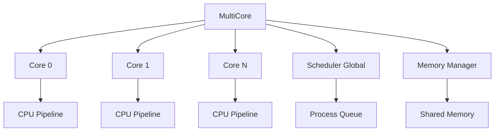

# Estrutura Multicore

## 🎯 Objetivo

Implementar uma arquitetura multicore que permita a execução paralela de processos em múltiplos núcleos (cores) de processamento.

---

## 🏗️ Arquitetura Geral



---

## 📋 Componentes Principais

### 1. Classe MultiCore

Gerencia múltiplos cores e coordena sua execução.

```cpp
// MultiCore.hpp
#ifndef MULTICORE_HPP
#define MULTICORE_HPP

#include <vector>
#include <memory>
#include <mutex>
#include <condition_variable>
#include "Core.hpp"
#include "RoundRobinScheduler.hpp"
#include "MemoryManager.hpp"

class MultiCore {
private:
    int num_cores;
    std::vector<std::unique_ptr<Core>> cores;
    std::unique_ptr<RoundRobinScheduler> scheduler;
    std::shared_ptr<MemoryManager> memory_manager;
    
    // Sincronização
    std::mutex global_mutex;
    std::condition_variable cv;
    bool running;
    
public:
    MultiCore(int num_cores);
    ~MultiCore();
    
    // Inicialização
    void initialize();
    void shutdown();
    
    // Controle de execução
    void start();
    void stop();
    void run();
    
    // Gerenciamento de processos
    void addProcess(std::shared_ptr<PCB> process);
    void removeProcess(int pid);
    
    // Estatísticas
    void printStatistics();
    std::vector<CoreMetrics> getMetrics();
};

#endif // MULTICORE_HPP
```

---

### 2. Implementação do Core Individual

Cada core executa independentemente com seu próprio pipeline.

```cpp
// Core.cpp (adaptado para multicore)

void Core::run() {
    while (running) {
        // Obter próximo processo do scheduler
        auto process = scheduler->getNextProcess(core_id);
        
        if (process == nullptr) {
            // Nenhum processo disponível, core fica ocioso
            std::this_thread::sleep_for(std::chrono::milliseconds(1));
            continue;
        }
        
        // Restaurar contexto do processo
        loadContext(process);
        
        // Executar por quantum
        int cycles_executed = 0;
        while (cycles_executed < quantum && process->state == RUNNING) {
            // Executar um ciclo do pipeline
            executeOneCycle();
            cycles_executed++;
            
            // Atualizar métricas
            updateMetrics();
        }
        
        // Salvar contexto
        saveContext(process);
        
        // Verificar se processo terminou
        if (process->state == TERMINATED) {
            scheduler->removeProcess(process->pid);
        } else {
            // Retornar para fila de prontos
            scheduler->enqueueProcess(process);
        }
    }
}
```

---

## 🔄 Sincronização entre Cores

### Mecanismos Implementados

#### 1. Mutex Global
Protege estruturas compartilhadas:
- Fila de processos
- Tabela de processos
- Memória compartilhada

```cpp
void MultiCore::addProcess(std::shared_ptr<PCB> process) {
    std::lock_guard<std::mutex> lock(global_mutex);
    scheduler->enqueueProcess(process);
    cv.notify_one(); // Acordar core ocioso
}
```

#### 2. Condition Variables
Para notificação entre cores:

```cpp
void Core::waitForProcess() {
    std::unique_lock<std::mutex> lock(scheduler->getMutex());
    scheduler->getConditionVariable().wait(lock, [this] {
        return scheduler->hasProcesses() || !running;
    });
}
```

#### 3. Atomic Operations
Para contadores e flags:

```cpp
std::atomic<int> active_processes{0};
std::atomic<bool> system_running{true};
```

---

## 📊 Gerenciamento de Carga

### Estratégias de Balanceamento

#### 1. Fila Global (Recomendado)
Todos os cores compartilham uma única fila de processos prontos.

**Vantagens:**
- ✅ Balanceamento automático
- ✅ Simples de implementar
- ✅ Evita desbalanceamento

**Desvantagens:**
- ⚠️ Contenção no acesso à fila
- ⚠️ Overhead de sincronização

```cpp
std::shared_ptr<PCB> RoundRobinScheduler::getNextProcess(int core_id) {
    std::lock_guard<std::mutex> lock(queue_mutex);
    
    if (ready_queue.empty()) {
        return nullptr;
    }
    
    auto process = ready_queue.front();
    ready_queue.pop_front();
    process->assigned_core = core_id;
    return process;
}
```

#### 2. Filas por Core
Cada core tem sua própria fila de processos.

**Vantagens:**
- ✅ Menos contenção
- ✅ Melhor cache locality

**Desvantagens:**
- ⚠️ Requer balanceamento explícito
- ⚠️ Risco de desbalanceamento

```cpp
void RoundRobinScheduler::balanceLoad() {
    // Calcular carga média
    double avg_load = total_processes / num_cores;
    
    // Redistribuir se necessário
    for (int i = 0; i < num_cores; i++) {
        if (core_queues[i].size() > avg_load * 1.2) {
            // Core sobrecarregado, migrar processos
            migrateProcesses(i);
        }
    }
}
```

---

## 🧵 Thread Management

### Implementação com C++ Threads

```cpp
// MultiCore.cpp

void MultiCore::start() {
    running = true;
    
    // Criar thread para cada core
    for (int i = 0; i < num_cores; i++) {
        core_threads.emplace_back([this, i]() {
            cores[i]->run();
        });
    }
}

void MultiCore::stop() {
    running = false;
    cv.notify_all();
    
    // Aguardar conclusão de todas as threads
    for (auto& thread : core_threads) {
        if (thread.joinable()) {
            thread.join();
        }
    }
}
```

---

## 📈 Métricas por Core

### Estrutura de Métricas

```cpp
struct CoreMetrics {
    int core_id;
    int processes_executed;
    int cycles_executed;
    double utilization;
    double idle_time;
    int context_switches;
    
    void print() {
        std::cout << "Core " << core_id << ":\n";
        std::cout << "  Processes: " << processes_executed << "\n";
        std::cout << "  Utilization: " << utilization << "%\n";
        std::cout << "  Idle Time: " << idle_time << "ms\n";
    }
};
```

### Coleta de Métricas

```cpp
void Core::updateMetrics() {
    metrics.cycles_executed++;
    
    if (current_process != nullptr) {
        metrics.utilization = 
            (double)metrics.cycles_executed / 
            (metrics.cycles_executed + metrics.idle_cycles) * 100.0;
    } else {
        metrics.idle_cycles++;
    }
}
```

---

## 🔍 Exemplo de Uso

```cpp
int main() {
    // Criar sistema multicore com 4 cores
    MultiCore system(4);
    
    // Inicializar
    system.initialize();
    
    // Adicionar processos
    for (int i = 0; i < 10; i++) {
        auto process = std::make_shared<PCB>();
        process->pid = i;
        process->burst_time = 100 + (i * 50);
        system.addProcess(process);
    }
    
    // Iniciar execução
    system.start();
    
    // Aguardar conclusão
    std::this_thread::sleep_for(std::chrono::seconds(10));
    
    // Parar sistema
    system.stop();
    
    // Imprimir estatísticas
    system.printStatistics();
    
    return 0;
}
```

---

## ⚠️ Problemas Comuns e Soluções

### 1. Race Conditions
**Problema:** Múltiplos cores acessando estruturas compartilhadas.

**Solução:**
```cpp
// Sempre proteger acesso com mutex
std::lock_guard<std::mutex> lock(shared_data_mutex);
// Código crítico aqui
```

### 2. Deadlocks
**Problema:** Cores aguardando recursos mutuamente.

**Solução:**
- Sempre adquirir locks na mesma ordem
- Usar timeout em condition variables
- Implementar detecção de deadlock

### 3. Starvation
**Problema:** Alguns processos nunca executam.

**Solução:**
- Implementar envelhecimento (aging)
- Garantir fairness no scheduler
- Monitorar tempo de espera

---

## 🧪 Testes Recomendados

### 1. Teste de Criação
```cpp
void testMultiCoreCreation() {
    MultiCore system(4);
    assert(system.getNumCores() == 4);
}
```

### 2. Teste de Execução Paralela
```cpp
void testParallelExecution() {
    MultiCore system(2);
    // Adicionar processos
    // Verificar que executam em paralelo
}
```

### 3. Teste de Sincronização
```cpp
void testSynchronization() {
    // Verificar que não há race conditions
    // Usar ThreadSanitizer
}
```

---

## 🔗 Próximos Passos

- ➡️ [Implementar Escalonador Round Robin](08-round-robin.md)
- ➡️ [Gerenciamento de Memória](09-memoria.md)
- ➡️ [Sincronização e Concorrência](10-sincronizacao.md)

---

## 📚 Referências

- TANENBAUM, A. S. Modern Operating Systems. 4th ed.
- SILBERSCHATZ, A. Operating System Concepts. 10th ed.
- C++ Concurrency in Action (Anthony Williams)
