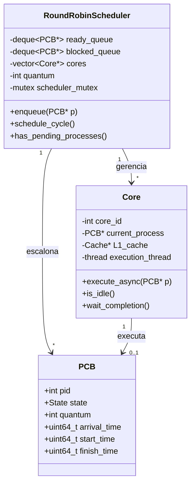

# Implementação do Escalonador Round Robin

## 🎯 Objetivo

Implementar um escalonador Round Robin **multicore** que distribui processos de forma justa entre múltiplos núcleos.

## 📚 Fundamentos Teóricos

### O que é Round Robin?

Round Robin é um algoritmo de escalonamento **preemptivo** onde:

1. Cada processo recebe um **quantum** de tempo (fatia de CPU)
2. Processos são organizados em uma **fila circular (FIFO)**
3. Quando o quantum expira, o processo volta ao **fim da fila**
4. O próximo processo da fila é executado

### Fórmulas Importantes

**Tempo de Espera:**
$$W_i = T_{retorno,i} - T_{execução,i}$$

**Tempo de Retorno (Turnaround):**
$$T_{retorno,i} = T_{término,i} - T_{chegada,i}$$

**Tempo Médio de Espera:**
$$\bar{W} = \frac{1}{n}\sum_{i=1}^{n} W_i$$

**Throughput:**
$$Throughput = \frac{n_{processos}}{T_{total}}$$

### Round Robin em Multicore

Em um sistema multicore, temos **duas estratégias principais**:

#### Estratégia 1: Fila Global (Recomendado)
```
┌─────────────────────────────────────┐
│   Fila Global de Prontos (FIFO)    │
│   [ P1 ] [ P2 ] [ P3 ] [ P4 ] ...   │
└────────┬────────┬────────┬──────────┘
         │        │        │
    ┌────▼───┐┌──▼────┐┌──▼────┐
    │ Core 0 ││Core 1 ││Core 2 │
    └────────┘└───────┘└───────┘
```

**Vantagens:**
- ✅ Balanceamento automático
- ✅ Implementação simples
- ✅ Sem inanição

**Desvantagens:**
- ❌ Contenção na fila (lock)
- ❌ Menor afinidade de cache

#### Estratégia 2: Fila por Núcleo
```
┌──────────┐  ┌──────────┐  ┌──────────┐
│Fila Core0│  │Fila Core1│  │Fila Core2│
│ [P1][P4] │  │ [P2][P5] │  │ [P3][P6] │
└─────┬────┘  └─────┬────┘  └─────┬────┘
      │             │              │
  ┌───▼──┐      ┌──▼───┐      ┌──▼───┐
  │Core 0│      │Core 1│      │Core 2│
  └──────┘      └──────┘      └──────┘
```

**Vantagens:**
- ✅ Menos contenção
- ✅ Melhor afinidade de cache

**Desvantagens:**
- ❌ Precisa load balancing
- ❌ Mais complexo

**Neste guia usaremos Fila Global.**

## 🏗️ Arquitetura da Solução

### Diagrama de Classes



## 📝 Implementação Passo a Passo

### Passo 1: Estrutura Básica do Escalonador

**Arquivo:** `src/cpu/RoundRobinScheduler.hpp`

```cpp
#ifndef ROUND_ROBIN_SCHEDULER_HPP
#define ROUND_ROBIN_SCHEDULER_HPP

#include <deque>
#include <vector>
#include <mutex>
#include <memory>
#include <chrono>
#include "PCB.hpp"

// Forward declaration
class Core;
class MemoryManager;
class IOManager;

class RoundRobinScheduler {
public:
    /**
     * Construtor
     * @param num_cores Número de núcleos
     * @param mem_manager Ponteiro para gerenciador de memória
     * @param io_manager Ponteiro para gerenciador de I/O
     * @param default_quantum Quantum padrão (ciclos)
     */
    RoundRobinScheduler(int num_cores, 
                        MemoryManager* mem_manager,
                        IOManager* io_manager,
                        int default_quantum = 100);
    
    ~RoundRobinScheduler();
    
    /**
     * Adiciona processo à fila de prontos
     */
    void add_process(PCB* process);
    
    /**
     * Executa um ciclo de escalonamento
     * - Atribui processos a núcleos livres
     * - Coleta processos finalizados
     * - Move processos bloqueados
     */
    void schedule_cycle();
    
    /**
     * Verifica se ainda há processos para executar
     */
    bool has_pending_processes() const;
    
    /**
     * Retorna número de processos finalizados
     */
    int get_finished_count() const { return finished_count; }
    
    /**
     * Retorna número total de processos
     */
    int get_total_count() const { return total_count; }
    
    /**
     * Retorna estatísticas agregadas
     */
    struct Statistics {
        double avg_wait_time;
        double avg_turnaround_time;
        double avg_cpu_utilization;
        double throughput;
        int total_context_switches;
    };
    
    Statistics get_statistics() const;
    
private:
    // Núcleos de processamento
    std::vector<std::unique_ptr<Core>> cores;
    
    // Filas de processos
    std::deque<PCB*> ready_queue;      // Prontos para executar
    std::deque<PCB*> blocked_queue;    // Bloqueados em I/O
    std::vector<PCB*> finished_list;   // Finalizados
    
    // Configuração
    int default_quantum;
    int num_cores;
    
    // Contadores
    int finished_count{0};
    int total_count{0};
    
    // Tempo de simulação
    uint64_t current_time{0};
    
    // Sincronização
    mutable std::mutex scheduler_mutex;
    
    // Gerenciadores externos
    MemoryManager* memory_manager;
    IOManager* io_manager;
    
    // Funções auxiliares
    void assign_process_to_core(PCB* process, Core* core);
    void collect_finished_processes();
    void handle_blocked_processes();
    void update_wait_times();
};

#endif // ROUND_ROBIN_SCHEDULER_HPP
```

### Passo 2: Implementação do Construtor

**Arquivo:** `src/cpu/RoundRobinScheduler.cpp`

```cpp
#include "RoundRobinScheduler.hpp"
#include "Core.hpp"
#include "../IO/IOManager.hpp"
#include <iostream>
#include <algorithm>

RoundRobinScheduler::RoundRobinScheduler(
    int num_cores, 
    MemoryManager* mem_manager,
    IOManager* io_manager,
    int default_quantum)
    : num_cores(num_cores),
      default_quantum(default_quantum),
      memory_manager(mem_manager),
      io_manager(io_manager)
{
    std::cout << "[Scheduler] Inicializando com " << num_cores 
              << " núcleos e quantum=" << default_quantum << "\n";
    
    // Criar núcleos
    for (int i = 0; i < num_cores; i++) {
        cores.push_back(
            std::make_unique<Core>(i, memory_manager)
        );
    }
    
    std::cout << "[Scheduler] Pronto!\n";
}

RoundRobinScheduler::~RoundRobinScheduler() {
    std::cout << "[Scheduler] Encerrando...\n";
    
    // Aguarda todos os núcleos terminarem
    for (auto& core : cores) {
        if (!core->is_idle()) {
            core->wait_completion();
        }
    }
}
```

### Passo 3: Adicionar Processo à Fila

```cpp
void RoundRobinScheduler::add_process(PCB* process) {
    std::lock_guard<std::mutex> lock(scheduler_mutex);
    
    // Define tempo de chegada
    process->arrival_time = current_time;
    
    // Define quantum (usa o do processo ou padrão)
    if (process->quantum == 0) {
        process->quantum = default_quantum;
    }
    
    // Adiciona à fila de prontos
    process->state = State::Ready;
    ready_queue.push_back(process);
    
    total_count++;
    
    std::cout << "[Scheduler] Processo P" << process->pid 
              << " adicionado (quantum=" << process->quantum 
              << ", prioridade=" << process->priority << ")\n";
}
```

### Passo 4: Ciclo Principal de Escalonamento

```cpp
void RoundRobinScheduler::schedule_cycle() {
    std::lock_guard<std::mutex> lock(scheduler_mutex);
    
    // Incrementa tempo de simulação
    current_time++;
    
    // 1. Processar processos bloqueados
    handle_blocked_processes();
    
    // 2. Atualizar tempos de espera
    update_wait_times();
    
    // 3. Atribuir processos a núcleos livres
    for (auto& core : cores) {
        if (core->is_idle() && !ready_queue.empty()) {
            PCB* process = ready_queue.front();
            ready_queue.pop_front();
            
            assign_process_to_core(process, core.get());
        }
    }
    
    // 4. Coletar processos que terminaram execução
    collect_finished_processes();
}
```

### Passo 5: Atribuição de Processo a Núcleo

```cpp
void RoundRobinScheduler::assign_process_to_core(
    PCB* process, 
    Core* core) 
{
    std::cout << "[Scheduler] Atribuindo P" << process->pid 
              << " ao Core " << core->get_id() 
              << " (quantum=" << process->quantum << ")\n";
    
    // Marca núcleo atribuído
    process->assigned_core = core->get_id();
    
    // Detecta mudança de núcleo (migração)
    if (process->last_core != -1 && 
        process->last_core != core->get_id()) 
    {
        process->context_switches++;
        std::cout << "[Scheduler] P" << process->pid 
                  << " migrou do Core " << process->last_core 
                  << " para Core " << core->get_id() << "\n";
    }
    
    process->last_core = core->get_id();
    
    // Registra primeira execução
    if (process->start_time == 0) {
        process->start_time = current_time;
        std::cout << "[Scheduler] P" << process->pid 
                  << " iniciou execução pela primeira vez\n";
    }
    
    // Marca como executando
    process->state = State::Running;
    
    // Inicia execução assíncrona
    core->execute_async(process);
}
```

### Passo 6: Coletar Processos Finalizados

```cpp
void RoundRobinScheduler::collect_finished_processes() {
    for (auto& core : cores) {
        // Pula núcleos ociosos
        if (core->is_idle()) continue;
        
        PCB* process = core->get_current_process();
        if (process == nullptr) continue;
        
        // Verifica se a thread já terminou
        if (!core->is_thread_running()) {
            core->wait_completion();
            
            switch (process->state) {
                case State::Finished:
                    // Processo terminou completamente
                    process->finish_time = current_time;
                    finished_list.push_back(process);
                    finished_count++;
                    
                    std::cout << "[Scheduler] P" << process->pid 
                              << " FINALIZADO"
                              << " (tempo total=" 
                              << process->get_turnaround_time() 
                              << " ciclos)\n";
                    break;
                
                case State::Blocked:
                    // Processo bloqueado em I/O
                    std::cout << "[Scheduler] P" << process->pid 
                              << " BLOQUEADO (I/O)\n";
                    
                    blocked_queue.push_back(process);
                    
                    // Registra no IOManager
                    io_manager->registerProcessWaitingForIO(process);
                    break;
                
                default:  // State::Ready
                    // Quantum expirou - volta para fila
                    std::cout << "[Scheduler] P" << process->pid 
                              << " PREEMPTADO (quantum expirou)\n";
                    
                    process->context_switches++;
                    ready_queue.push_back(process);  // Fim da fila
                    break;
            }
        }
    }
}
```

### Passo 7: Tratar Processos Bloqueados

```cpp
void RoundRobinScheduler::handle_blocked_processes() {
    auto it = blocked_queue.begin();
    
    while (it != blocked_queue.end()) {
        PCB* process = *it;
        
        // I/O completou? (IOManager muda estado)
        if (process->state == State::Ready) {
            std::cout << "[Scheduler] P" << process->pid 
                      << " DESBLOQUEADO (I/O completo)\n";
            
            // Move de volta para fila de prontos
            ready_queue.push_back(process);
            it = blocked_queue.erase(it);
        } else {
            ++it;
        }
    }
}
```

### Passo 8: Atualizar Tempos de Espera

```cpp
void RoundRobinScheduler::update_wait_times() {
    // Para cada processo na fila de prontos
    for (PCB* process : ready_queue) {
        process->total_wait_time++;
    }
}
```

### Passo 9: Verificar Processos Pendentes

```cpp
bool RoundRobinScheduler::has_pending_processes() const {
    std::lock_guard<std::mutex> lock(scheduler_mutex);
    
    // Há processos pendentes se:
    // - Fila de prontos não está vazia, OU
    // - Fila de bloqueados não está vazia, OU
    // - Algum núcleo está ocupado, OU
    // - Processos finalizados < total
    
    if (!ready_queue.empty()) return true;
    if (!blocked_queue.empty()) return true;
    
    for (const auto& core : cores) {
        if (!core->is_idle()) return true;
    }
    
    return (finished_count < total_count);
}
```

### Passo 10: Calcular Estatísticas

```cpp
RoundRobinScheduler::Statistics 
RoundRobinScheduler::get_statistics() const 
{
    std::lock_guard<std::mutex> lock(scheduler_mutex);
    
    Statistics stats = {};
    
    if (finished_list.empty()) {
        return stats;
    }
    
    uint64_t total_wait = 0;
    uint64_t total_turnaround = 0;
    int total_switches = 0;
    
    for (const PCB* process : finished_list) {
        total_wait += process->get_wait_time();
        total_turnaround += process->get_turnaround_time();
        total_switches += process->context_switches.load();
    }
    
    int n = finished_list.size();
    
    // Médias
    stats.avg_wait_time = (double)total_wait / n;
    stats.avg_turnaround_time = (double)total_turnaround / n;
    stats.total_context_switches = total_switches;
    
    // Throughput (processos por ciclo)
    if (current_time > 0) {
        stats.throughput = (double)finished_count / current_time;
    }
    
    // Utilização da CPU
    uint64_t total_busy_time = 0;
    for (const PCB* p : finished_list) {
        total_busy_time += p->pipeline_cycles.load();
    }
    
    uint64_t total_available_time = current_time * num_cores;
    if (total_available_time > 0) {
        stats.avg_cpu_utilization = 
            (double)total_busy_time / total_available_time;
    }
    
    return stats;
}
```

## 🧪 Testando o Escalonador

### Teste 1: Dois Processos, Dois Núcleos

**Cenário:**
- Processo P1: 200 ciclos, quantum=100
- Processo P2: 200 ciclos, quantum=100
- 2 núcleos

**Execução Esperada:**
```
Tempo | Core 0        | Core 1        | Fila
------|---------------|---------------|-------------
0     | P1 (0-100)    | P2 (0-100)    | []
100   | P1 (100-200)  | P2 (100-200)  | []
200   | IDLE          | IDLE          | []
```

**Resultado:**
- Tempo total: ~200 ciclos
- Speedup vs single-core: ~2x
- Context switches: 0 (nenhum processo precisa ser preemptado)

### Teste 2: Três Processos, Dois Núcleos

**Cenário:**
- P1: 150 ciclos, quantum=100
- P2: 150 ciclos, quantum=100
- P3: 150 ciclos, quantum=100
- 2 núcleos

**Execução Esperada:**
```
Tempo | Core 0        | Core 1        | Fila
------|---------------|---------------|-------------
0     | P1 (0-100)    | P2 (0-100)    | [P3]
100   | P3 (0-100)    | P2 (100-150)  | [P1]
150   | P3 (100-150)  | P1 (100-150)  | []
200   | IDLE          | IDLE          | []
```

**Resultado:**
- P2 termina primeiro (tempo=150)
- P1 e P3 terminam depois (tempo=200)
- Context switches: 2 (P1 e P3 preemptados)

### Teste 3: Carga Pesada

**Cenário:**
- 10 processos
- 500 ciclos cada
- quantum=100
- 4 núcleos

**Métricas Esperadas:**
- Utilização CPU: ~100%
- Tempo total: ~1250 ciclos
- Speedup: ~4x vs single-core

## 📊 Métricas Coletadas

### Por Processo
```cpp
// No final, cada PCB terá:
std::cout << "Processo " << pcb.pid << ":\n";
std::cout << "  Tempo de Chegada: " << pcb.arrival_time << "\n";
std::cout << "  Tempo de Início: " << pcb.start_time << "\n";
std::cout << "  Tempo de Término: " << pcb.finish_time << "\n";
std::cout << "  Tempo de Execução: " << pcb.pipeline_cycles << "\n";
std::cout << "  Tempo de Espera: " << pcb.get_wait_time() << "\n";
std::cout << "  Tempo de Retorno: " << pcb.get_turnaround_time() << "\n";
std::cout << "  Context Switches: " << pcb.context_switches << "\n";
```

### Globais
```cpp
auto stats = scheduler.get_statistics();
std::cout << "\nEstatísticas Globais:\n";
std::cout << "  Tempo Médio de Espera: " << stats.avg_wait_time << "\n";
std::cout << "  Tempo Médio de Retorno: " << stats.avg_turnaround_time << "\n";
std::cout << "  Utilização Média da CPU: " << stats.avg_cpu_utilization * 100 << "%\n";
std::cout << "  Throughput: " << stats.throughput << " proc/ciclo\n";
std::cout << "  Context Switches Totais: " << stats.total_context_switches << "\n";
```

## 🐛 Problemas Comuns e Soluções

### Problema 1: Deadlock na Fila

**Sintoma:** Programa trava.

**Causa:** Mutex travado.

**Solução:**
```cpp
// Sempre usar lock_guard (RAII)
std::lock_guard<std::mutex> lock(scheduler_mutex);
// Lock é liberado automaticamente
```

### Problema 2: Race Condition

**Sintoma:** Métricas inconsistentes.

**Causa:** Acesso concorrente sem lock.

**Solução:**
```cpp
// Use atomic para contadores
std::atomic<uint64_t> pipeline_cycles{0};

// Ou proteja com mutex
std::lock_guard<std::mutex> lock(mutex);
process->state = State::Finished;
```

### Problema 3: Quantum Não Respeitado

**Sintoma:** Processos executam além do quantum.

**Causa:** Loop de execução não verifica limite.

**Solução:**
```cpp
// Em Core::run_process()
int cycles_in_quantum = 0;

while (!endProgram && 
       cycles_in_quantum < process->quantum) {  // ← Verificar!
    
    execute_pipeline_cycle();
    cycles_in_quantum++;
}
```

## 📖 Próximos Passos

Agora vamos ver como implementar a gerência de memória:

➡️ [**Gerenciamento de Memória Segmentada**](09-memoria.md)

