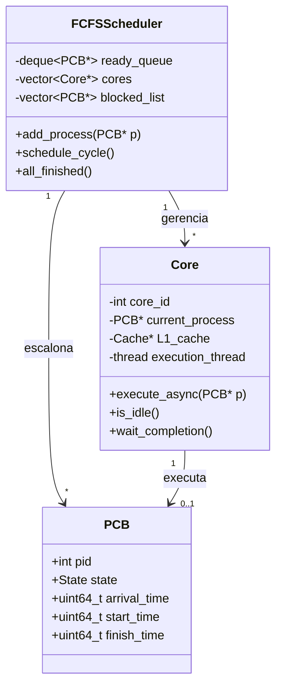

# Implementação do Escalonador FCFS (First Come, First Served)

## 🎯 Objetivo

Implementar um escalonador FCFS **multicore** que executa os processos na ordem de chegada, sem preempção por quantum.

## 📚 Fundamentos Teóricos

### O que é FCFS?

FCFS é um algoritmo de escalonamento **não-preemptivo** onde:

1. Todos os processos do lote inicial são carregados na memória antes da execução.
2. Cada núcleo pega o próximo processo disponível na fila de prontos (FIFO) e executa até terminar ou bloquear por I/O.
3. Quando um processo termina ou bloqueia, o núcleo pega o próximo da fila.
4. Não há preempção: o processo só sai do núcleo quando termina ou bloqueia.

### Fórmulas Importantes

**Tempo de Espera:**
$$W_i = T_{retorno,i} - T_{execução,i}$$

**Tempo de Retorno (Turnaround):**
$$T_{retorno,i} = T_{término,i} - T_{chegada,i}$$

**Tempo Médio de Espera:**
$$\bar{W} = \frac{1}{n}\sum_{i=1}^{n} W_i$$

**Throughput:**
$$Throughput = \frac{n_{processos}}{T_{total}}$$

### FCFS em Multicore

Em um sistema multicore, o FCFS distribui múltiplos processos entre múltiplos núcleos, mantendo a ordem de chegada:

```
┌─────────────────────────────────────┐
│   Fila Global de Prontos (FIFO)    │
│   [ P1 ] [ P2 ] [ P3 ] [ P4 ] ...   │
└────────┬────────┬────────┬──────────┘
         │        │        │
    ┌────▼───┐┌──▼────┐┌──▼────┐
    │ Core 0 ││Core 1 ││Core 2 │
    └────────┘└───────┘└──────┘
```

**Vantagens:**
- ✅ Simplicidade
- ✅ Determinismo
- ✅ Sem inanição

**Desvantagens:**
- ❌ Pode causar espera longa para processos grandes
- ❌ Não prioriza processos curtos

## 🏗️ Arquitetura da Solução

### Diagrama de Classes



## 📝 Implementação Passo a Passo

### Passo 1: Estrutura Básica do Escalonador

**Arquivo:** `src/cpu/FCFSScheduler.hpp`

```cpp
#pragma once
#include <vector>
#include <deque>
#include <memory>
#include "PCB.hpp"
#include "Core.hpp"
#include "IOManager.hpp"
#include "memory/MemoryManager.hpp"

class FCFSScheduler {
public:
    FCFSScheduler(int num_cores, MemoryManager* memManager, IOManager* ioManager);
    void add_process(PCB* process);
    void schedule_cycle();
    bool all_finished() const;
    std::vector<std::unique_ptr<Core>>& get_cores();
    std::deque<PCB*>& get_ready_queue();
    std::vector<PCB*>& get_blocked_list();
private:
    int num_cores;
    MemoryManager* memManager;
    IOManager* ioManager;
    std::vector<std::unique_ptr<Core>> cores;
    std::deque<PCB*> ready_queue;
    std::vector<PCB*> blocked_list;
};
```

### Passo 2: Implementação do Construtor

**Arquivo:** `src/cpu/FCFSScheduler.cpp`

```cpp
#include "FCFSScheduler.hpp"
#include <iostream>

FCFSScheduler::FCFSScheduler(int num_cores, MemoryManager* memManager, IOManager* ioManager)
    : num_cores(num_cores), memManager(memManager), ioManager(ioManager) {
    for (int i = 0; i < num_cores; i++) {
        cores.push_back(std::make_unique<Core>(i, memManager));
    }
}
```

### Passo 3: Adicionar Processo à Fila

```cpp
void FCFSScheduler::add_process(PCB* process) {
    ready_queue.push_back(process);
}
```

### Passo 4: Ciclo Principal de Escalonamento

```cpp
void FCFSScheduler::schedule_cycle() {
    // Desbloqueia processos do IO
    for (auto it = blocked_list.begin(); it != blocked_list.end(); ) {
        if ((*it)->state == State::Ready) {
            ready_queue.push_back(*it);
            it = blocked_list.erase(it);
        } else {
            ++it;
        }
    }
    // Atribui processos aos núcleos livres
    for (auto& core : cores) {
        if (core->is_idle() && !ready_queue.empty()) {
            PCB* process = ready_queue.front();
            ready_queue.pop_front();
            core->execute_async(process);
        }
    }
    // Coleta processos finalizados ou bloqueados
    for (auto& core : cores) {
        if (!core->is_idle() && !core->is_thread_running()) {
            PCB* process = core->get_current_process();
            if (process) {
                core->wait_completion();
                switch (process->state) {
                    case State::Finished:
                        break;
                    case State::Blocked:
                        ioManager->registerProcessWaitingForIO(process);
                        blocked_list.push_back(process);
                        break;
                    default:
                        ready_queue.push_back(process);
                        break;
                }
            }
        }
    }
}
```

### Passo 5: Verificar Fim da Execução

```cpp
bool FCFSScheduler::all_finished() const {
    for (const auto& core : cores) {
        if (!core->is_idle()) return false;
    }
    return ready_queue.empty() && blocked_list.empty();
}
```

## 🧪 Testando o Escalonador

### Teste: Múltiplos Processos, Múltiplos Núcleos

**Cenário:**
- 3 processos (P1, P2, P3)
- 2 núcleos
- Todos carregados antes da execução

**Execução Esperada:**
- Núcleos pegam processos em ordem de chegada
- Cada processo executa até terminar ou bloquear
- Quando um núcleo fica livre, pega o próximo da fila

**Como usar:**
```bash
./simulador --policy FCFS \
    -p test_programs/cpu_intensive.json test_programs/pcb_cpu_intensive.json \
    -p test_programs/io_bound.json test_programs/pcb_io_bound.json \
    -p test_programs/mixed_workload.json test_programs/pcb_mixed.json
```

## 📊 Métricas Coletadas

- Tempo de espera
- Tempo de retorno
- Utilização da CPU
- Throughput

## 🐛 Problemas Comuns e Soluções

- **Processos grandes podem causar espera longa para os demais**
- **FCFS não prioriza processos curtos**
- **Simples de implementar e serve como baseline para comparação**

## 📖 Próximos Passos

➡️ [**Implementação do Round Robin**](08-round-robin.md)
➡️ [**Gerenciamento de Memória Segmentada**](09-memoria.md)
