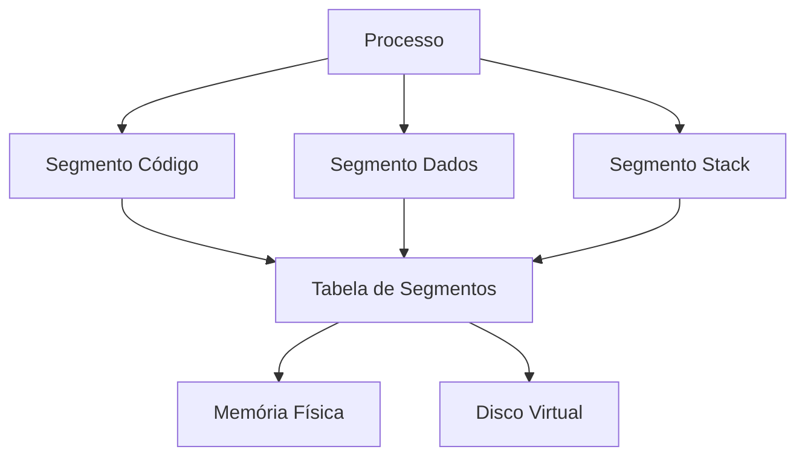

# Gerenciamento de Memória

## 🎯 Objetivo

Implementar gerenciamento de memória segmentada com políticas de substituição FIFO e LRU para o simulador multicore.

---

## 🏗️ Arquitetura de Memória



---

## 📋 Estruturas de Dados

### 1. Segmento de Memória

```cpp
// Segment.hpp
#ifndef SEGMENT_HPP
#define SEGMENT_HPP

#include <string>
#include <ctime>

enum SegmentType {
    CODE,
    DATA,
    STACK,
    HEAP
};

struct Segment {
    int segment_id;
    int process_id;
    SegmentType type;
    int base_address;
    int limit;
    int size;
    bool in_memory;
    bool modified;
    time_t last_access;
    int access_count;
    
    Segment(int id, int pid, SegmentType t, int size)
        : segment_id(id), process_id(pid), type(t), 
          size(size), in_memory(false), modified(false),
          access_count(0) {
        last_access = time(nullptr);
    }
    
    bool isValid(int offset) const {
        return offset >= 0 && offset < limit;
    }
};

#endif // SEGMENT_HPP
```

---

### 2. Tabela de Segmentos

```cpp
// SegmentTable.hpp
#ifndef SEGMENT_TABLE_HPP
#define SEGMENT_TABLE_HPP

#include <vector>
#include <map>
#include <memory>
#include "Segment.hpp"

class SegmentTable {
private:
    int process_id;
    std::map<int, std::shared_ptr<Segment>> segments;
    
public:
    SegmentTable(int pid) : process_id(pid) {}
    
    void addSegment(std::shared_ptr<Segment> segment) {
        segments[segment->segment_id] = segment;
    }
    
    std::shared_ptr<Segment> getSegment(int segment_id) {
        auto it = segments.find(segment_id);
        if (it != segments.end()) {
            return it->second;
        }
        return nullptr;
    }
    
    std::vector<std::shared_ptr<Segment>> getAllSegments() {
        std::vector<std::shared_ptr<Segment>> result;
        for (auto& pair : segments) {
            result.push_back(pair.second);
        }
        return result;
    }
    
    void removeSegment(int segment_id) {
        segments.erase(segment_id);
    }
    
    int getTotalSize() const {
        int total = 0;
        for (const auto& pair : segments) {
            total += pair.second->size;
        }
        return total;
    }
};

#endif // SEGMENT_TABLE_HPP
```

---

## 🔄 Políticas de Substituição

### 1. FIFO (First-In-First-Out)

```cpp
// FIFOPolicy.hpp
#ifndef FIFO_POLICY_HPP
#define FIFO_POLICY_HPP

#include <queue>
#include <memory>
#include "Segment.hpp"

class FIFOPolicy {
private:
    std::queue<int> fifo_queue; // IDs dos segmentos
    
public:
    void addSegment(int segment_id) {
        fifo_queue.push(segment_id);
    }
    
    int selectVictim() {
        if (fifo_queue.empty()) {
            return -1;
        }
        
        int victim = fifo_queue.front();
        fifo_queue.pop();
        return victim;
    }
    
    void removeSegment(int segment_id) {
        // Para FIFO, não precisamos remover explicitamente
        // pois a ordem já está definida na fila
    }
    
    std::string getName() const {
        return "FIFO";
    }
};

#endif // FIFO_POLICY_HPP
```

---

### 2. LRU (Least Recently Used)

```cpp
// LRUPolicy.hpp
#ifndef LRU_POLICY_HPP
#define LRU_POLICY_HPP

#include <map>
#include <list>
#include <memory>
#include "Segment.hpp"

class LRUPolicy {
private:
    // Lista para manter ordem de uso (mais recente no início)
    std::list<int> lru_list;
    
    // Map para acesso rápido à posição na lista
    std::map<int, std::list<int>::iterator> lru_map;
    
public:
    void addSegment(int segment_id) {
        // Adicionar no início da lista (mais recente)
        lru_list.push_front(segment_id);
        lru_map[segment_id] = lru_list.begin();
    }
    
    void accessSegment(int segment_id) {
        auto it = lru_map.find(segment_id);
        if (it != lru_map.end()) {
            // Remover da posição atual
            lru_list.erase(it->second);
            
            // Adicionar no início (mais recente)
            lru_list.push_front(segment_id);
            lru_map[segment_id] = lru_list.begin();
        }
    }
    
    int selectVictim() {
        if (lru_list.empty()) {
            return -1;
        }
        
        // Vítima é o último (menos recentemente usado)
        int victim = lru_list.back();
        lru_list.pop_back();
        lru_map.erase(victim);
        
        return victim;
    }
    
    void removeSegment(int segment_id) {
        auto it = lru_map.find(segment_id);
        if (it != lru_map.end()) {
            lru_list.erase(it->second);
            lru_map.erase(it);
        }
    }
    
    std::string getName() const {
        return "LRU";
    }
};

#endif // LRU_POLICY_HPP
```

---

## 🎛️ Gerenciador de Segmentação

```cpp
// SegmentationManager.hpp
#ifndef SEGMENTATION_MANAGER_HPP
#define SEGMENTATION_MANAGER_HPP

#include <memory>
#include <map>
#include <mutex>
#include "Segment.hpp"
#include "SegmentTable.hpp"
#include "FIFOPolicy.hpp"
#include "LRUPolicy.hpp"

enum ReplacementPolicy {
    FIFO_POLICY,
    LRU_POLICY
};

class SegmentationManager {
private:
    int memory_size;
    int available_memory;
    ReplacementPolicy policy;
    
    // Tabelas de segmentos por processo
    std::map<int, std::unique_ptr<SegmentTable>> process_tables;
    
    // Política de substituição
    std::unique_ptr<FIFOPolicy> fifo_policy;
    std::unique_ptr<LRUPolicy> lru_policy;
    
    // Sincronização
    std::mutex manager_mutex;
    
    // Métricas
    int page_faults;
    int page_hits;
    int swaps;
    
public:
    SegmentationManager(int mem_size, ReplacementPolicy pol)
        : memory_size(mem_size), 
          available_memory(mem_size),
          policy(pol),
          page_faults(0),
          page_hits(0),
          swaps(0) {
        
        if (policy == FIFO_POLICY) {
            fifo_policy = std::make_unique<FIFOPolicy>();
        } else {
            lru_policy = std::make_unique<LRUPolicy>();
        }
    }
    
    // Criar tabela de segmentos para processo
    void createProcessTable(int pid) {
        std::lock_guard<std::mutex> lock(manager_mutex);
        process_tables[pid] = std::make_unique<SegmentTable>(pid);
    }
    
    // Alocar segmento
    bool allocateSegment(int pid, SegmentType type, int size) {
        std::lock_guard<std::mutex> lock(manager_mutex);
        
        // Verificar se há espaço
        if (available_memory < size) {
            // Tentar liberar espaço
            if (!freeMemory(size)) {
                return false; // Não conseguiu liberar
            }
        }
        
        // Criar segmento
        int segment_id = generateSegmentId();
        auto segment = std::make_shared<Segment>(segment_id, pid, type, size);
        segment->in_memory = true;
        segment->base_address = allocatePhysicalMemory(size);
        segment->limit = size;
        
        // Adicionar à tabela
        process_tables[pid]->addSegment(segment);
        
        // Adicionar à política de substituição
        if (policy == FIFO_POLICY) {
            fifo_policy->addSegment(segment_id);
        } else {
            lru_policy->addSegment(segment_id);
        }
        
        available_memory -= size;
        return true;
    }
    
    // Acessar segmento
    std::shared_ptr<Segment> accessSegment(int pid, int segment_id, int offset) {
        std::lock_guard<std::mutex> lock(manager_mutex);
        
        auto table = process_tables[pid].get();
        if (!table) return nullptr;
        
        auto segment = table->getSegment(segment_id);
        if (!segment) return nullptr;
        
        // Verificar validade do offset
        if (!segment->isValid(offset)) {
            throw std::runtime_error("Segmentation fault: invalid offset");
        }
        
        // Se não está em memória, fazer swap
        if (!segment->in_memory) {
            page_faults++;
            swapIn(segment);
        } else {
            page_hits++;
        }
        
        // Atualizar informações de acesso
        segment->last_access = time(nullptr);
        segment->access_count++;
        
        // Atualizar LRU se necessário
        if (policy == LRU_POLICY) {
            lru_policy->accessSegment(segment_id);
        }
        
        return segment;
    }
    
    // Liberar segmentos de um processo
    void freeProcess(int pid) {
        std::lock_guard<std::mutex> lock(manager_mutex);
        
        auto table = process_tables[pid].get();
        if (!table) return;
        
        auto segments = table->getAllSegments();
        for (auto& segment : segments) {
            if (segment->in_memory) {
                available_memory += segment->size;
            }
            
            // Remover da política
            if (policy == FIFO_POLICY) {
                fifo_policy->removeSegment(segment->segment_id);
            } else {
                lru_policy->removeSegment(segment->segment_id);
            }
        }
        
        process_tables.erase(pid);
    }
    
    // Estatísticas
    void printStatistics() {
        std::lock_guard<std::mutex> lock(manager_mutex);
        
        std::cout << "\n=== Memory Management Statistics ===\n";
        std::cout << "Total Memory: " << memory_size << " bytes\n";
        std::cout << "Available Memory: " << available_memory << " bytes\n";
        std::cout << "Used Memory: " << (memory_size - available_memory) << " bytes\n";
        std::cout << "Page Faults: " << page_faults << "\n";
        std::cout << "Page Hits: " << page_hits << "\n";
        std::cout << "Swaps: " << swaps << "\n";
        
        double hit_rate = (double)page_hits / (page_hits + page_faults) * 100.0;
        std::cout << "Hit Rate: " << hit_rate << "%\n";
    }
    
private:
    bool freeMemory(int required_size) {
        while (available_memory < required_size) {
            int victim_id = -1;
            
            // Selecionar vítima
            if (policy == FIFO_POLICY) {
                victim_id = fifo_policy->selectVictim();
            } else {
                victim_id = lru_policy->selectVictim();
            }
            
            if (victim_id == -1) {
                return false; // Não há mais segmentos para remover
            }
            
            // Encontrar e fazer swap out do segmento
            swapOutSegment(victim_id);
        }
        
        return true;
    }
    
    void swapIn(std::shared_ptr<Segment> segment) {
        // Simular leitura do disco
        segment->in_memory = true;
        swaps++;
    }
    
    void swapOutSegment(int segment_id) {
        // Encontrar segmento em todas as tabelas
        for (auto& pair : process_tables) {
            auto segment = pair.second->getSegment(segment_id);
            if (segment && segment->in_memory) {
                segment->in_memory = false;
                available_memory += segment->size;
                swaps++;
                return;
            }
        }
    }
    
    int allocatePhysicalMemory(int size) {
        // Simplificado: retornar endereço base fictício
        static int next_address = 0;
        int address = next_address;
        next_address += size;
        return address;
    }
    
    int generateSegmentId() {
        static int next_id = 0;
        return next_id++;
    }
};

#endif // SEGMENTATION_MANAGER_HPP
```

---

## 🧪 Exemplo de Uso

```cpp
int main() {
    // Criar gerenciador com 1MB de memória e política LRU
    SegmentationManager manager(1024 * 1024, LRU_POLICY);
    
    // Criar processo
    int pid = 1;
    manager.createProcessTable(pid);
    
    // Alocar segmentos
    manager.allocateSegment(pid, CODE, 4096);
    manager.allocateSegment(pid, DATA, 8192);
    manager.allocateSegment(pid, STACK, 4096);
    
    // Acessar segmentos
    auto segment = manager.accessSegment(pid, 0, 100);
    
    // Liberar processo
    manager.freeProcess(pid);
    
    // Imprimir estatísticas
    manager.printStatistics();
    
    return 0;
}
```

---

## 📊 Comparação FIFO vs LRU

| Critério | FIFO | LRU |
|----------|------|-----|
| **Complexidade** | O(1) | O(log n) |
| **Memória Extra** | Baixa | Média |
| **Taxa de Acerto** | Média | Alta |
| **Implementação** | Simples | Moderada |
| **Overhead** | Baixo | Médio |

---

## 🔗 Próximos Passos

- ➡️ [Sincronização e Concorrência](10-sincronizacao.md)
- ➡️ [Métricas de Desempenho](11-metricas.md)

---

## 📚 Referências

- TANENBAUM, A. S. Modern Operating Systems. Cap. 3
- SILBERSCHATZ, A. Operating System Concepts. Cap. 9
