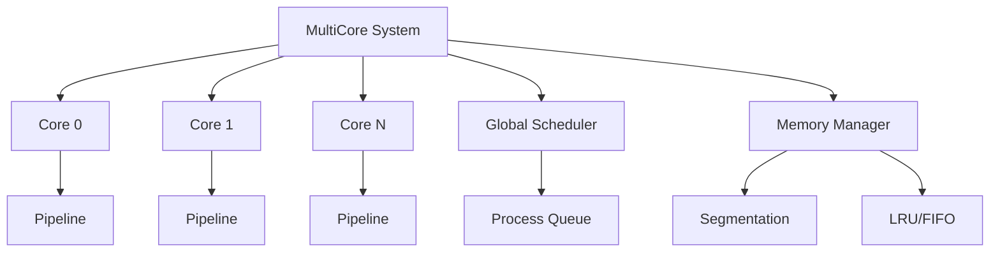

# Resultados e Gráficos

## 🎯 Objetivo

Guia para geração, análise e apresentação de resultados experimentais e gráficos para o artigo IEEE.

---

## 📊 Tipos de Gráficos

### 1. Gráfico de Speedup

**Propósito:** Mostrar ganho de desempenho com múltiplos cores.

**Dados Necessários:**
- Tempo de execução para 1, 2, 4, 8 cores
- Speedup = Tempo(1 core) / Tempo(N cores)

**Código Python:**
```python
import matplotlib.pyplot as plt
import numpy as np

# Dados
cores = [1, 2, 4, 8]
speedup = [1.0, 1.8, 3.3, 5.5]
ideal = [1.0, 2.0, 4.0, 8.0]

# Gráfico
plt.figure(figsize=(8, 6))
plt.plot(cores, speedup, 'o-', linewidth=2, markersize=8, label='Real')
plt.plot(cores, ideal, '--', linewidth=2, label='Ideal')
plt.xlabel('Número de Cores', fontsize=12)
plt.ylabel('Speedup', fontsize=12)
plt.title('Speedup vs Número de Cores', fontsize=14)
plt.grid(True, alpha=0.3)
plt.legend(fontsize=11)
plt.tight_layout()
plt.savefig('speedup.png', dpi=300, bbox_inches='tight')
plt.savefig('speedup.pdf', bbox_inches='tight')  # Para LaTeX
plt.show()
```

---

### 2. Gráfico de Eficiência

**Propósito:** Mostrar utilização efetiva dos cores.

**Fórmula:** Eficiência = Speedup / N cores

**Código Python:**
```python
# Dados
cores = [1, 2, 4, 8]
efficiency = [100, 90, 82, 69]  # Em percentual

plt.figure(figsize=(8, 6))
plt.bar(cores, efficiency, width=0.6, alpha=0.8, color='steelblue')
plt.xlabel('Número de Cores', fontsize=12)
plt.ylabel('Eficiência (%)', fontsize=12)
plt.title('Eficiência vs Número de Cores', fontsize=14)
plt.ylim(0, 110)
plt.grid(True, axis='y', alpha=0.3)

# Adicionar valores nas barras
for i, (c, e) in enumerate(zip(cores, efficiency)):
    plt.text(c, e + 2, f'{e}%', ha='center', fontsize=10)

plt.tight_layout()
plt.savefig('efficiency.png', dpi=300, bbox_inches='tight')
plt.show()
```

---

### 3. Comparação FIFO vs LRU

**Propósito:** Comparar políticas de substituição.

**Código Python:**
```python
import numpy as np
import matplotlib.pyplot as plt

# Dados
metrics = ['Hit Rate\n(%)', 'Page\nFaults', 'Swaps', 'Tempo\n(s)']
fifo = [75.3, 247, 156, 12.4]
lru = [85.7, 143, 98, 10.2]

x = np.arange(len(metrics))
width = 0.35

fig, ax = plt.subplots(figsize=(10, 6))
bars1 = ax.bar(x - width/2, fifo, width, label='FIFO', alpha=0.8, color='coral')
bars2 = ax.bar(x + width/2, lru, width, label='LRU', alpha=0.8, color='lightblue')

ax.set_xlabel('Métricas', fontsize=12)
ax.set_ylabel('Valores', fontsize=12)
ax.set_title('Comparação de Políticas de Substituição de Memória', fontsize=14)
ax.set_xticks(x)
ax.set_xticklabels(metrics, fontsize=10)
ax.legend(fontsize=11)
ax.grid(True, axis='y', alpha=0.3)

# Adicionar valores
for bars in [bars1, bars2]:
    for bar in bars:
        height = bar.get_height()
        ax.text(bar.get_x() + bar.get_width()/2., height,
                f'{height:.1f}',
                ha='center', va='bottom', fontsize=9)

plt.tight_layout()
plt.savefig('fifo_vs_lru.png', dpi=300, bbox_inches='tight')
plt.show()
```

---

### 4. Turnaround Time vs Quantum

**Propósito:** Mostrar impacto do quantum no tempo de turnaround.

**Código Python:**
```python
# Dados
quantum = [5, 10, 20, 50, 100]
turnaround = [250, 180, 160, 155, 158]

plt.figure(figsize=(8, 6))
plt.plot(quantum, turnaround, 'o-', linewidth=2, markersize=8, color='darkgreen')
plt.xlabel('Quantum (ciclos)', fontsize=12)
plt.ylabel('Tempo Médio de Turnaround (ms)', fontsize=12)
plt.title('Impacto do Quantum no Turnaround Time', fontsize=14)
plt.grid(True, alpha=0.3)

# Destacar ponto ótimo
optimal_idx = turnaround.index(min(turnaround))
plt.plot(quantum[optimal_idx], turnaround[optimal_idx], 'ro', markersize=12)
plt.annotate('Ótimo', 
             xy=(quantum[optimal_idx], turnaround[optimal_idx]),
             xytext=(quantum[optimal_idx] + 10, turnaround[optimal_idx] + 15),
             arrowprops=dict(arrowstyle='->', color='red'),
             fontsize=10)

plt.tight_layout()
plt.savefig('quantum_impact.png', dpi=300, bbox_inches='tight')
plt.show()
```

---

### 5. Utilização de CPU por Core

**Propósito:** Mostrar balanceamento de carga.

**Código Python:**
```python
# Dados
cores = ['Core 0', 'Core 1', 'Core 2', 'Core 3']
utilization = [87, 89, 85, 88]

plt.figure(figsize=(8, 6))
colors = plt.cm.Blues(np.linspace(0.4, 0.8, len(cores)))
bars = plt.bar(cores, utilization, color=colors, alpha=0.8)
plt.xlabel('Cores', fontsize=12)
plt.ylabel('Utilização (%)', fontsize=12)
plt.title('Utilização de CPU por Core', fontsize=14)
plt.ylim(0, 100)
plt.axhline(y=np.mean(utilization), color='r', linestyle='--', 
            label=f'Média: {np.mean(utilization):.1f}%')
plt.grid(True, axis='y', alpha=0.3)
plt.legend()

# Valores nas barras
for bar in bars:
    height = bar.get_height()
    plt.text(bar.get_x() + bar.get_width()/2., height + 1,
             f'{height}%', ha='center', va='bottom', fontsize=10)

plt.tight_layout()
plt.savefig('cpu_utilization.png', dpi=300, bbox_inches='tight')
plt.show()
```

---

### 6. Heatmap de Métricas

**Propósito:** Visualizar múltiplas métricas simultaneamente.

**Código Python:**
```python
import seaborn as sns

# Dados
processes = ['P1', 'P2', 'P3', 'P4', 'P5']
metrics_names = ['Waiting\nTime', 'Turnaround\nTime', 'Response\nTime']
data = np.array([
    [120, 220, 50],   # P1
    [150, 280, 45],   # P2
    [80, 190, 35],    # P3
    [200, 350, 60],   # P4
    [110, 240, 40]    # P5
])

plt.figure(figsize=(8, 6))
sns.heatmap(data, annot=True, fmt='d', cmap='YlOrRd', 
            xticklabels=metrics_names, yticklabels=processes,
            cbar_kws={'label': 'Tempo (ms)'})
plt.title('Métricas de Processos', fontsize=14)
plt.tight_layout()
plt.savefig('process_metrics_heatmap.png', dpi=300, bbox_inches='tight')
plt.show()
```

---

## 📈 Tabelas para o Artigo

### Tabela 1: Configuração Experimental

```latex
\begin{table}[htbp]
\caption{Configuração do Ambiente Experimental}
\begin{center}
\begin{tabular}{|l|l|}
\hline
\textbf{Componente} & \textbf{Especificação} \\
\hline
Processador & Intel Core i7-9700K @ 3.6GHz \\
Memória RAM & 16GB DDR4 \\
SO & Ubuntu 22.04 LTS \\
Compilador & GCC 11.3.0 \\
Flags & -O3 -std=c++17 -pthread \\
\hline
\end{tabular}
\label{tab:setup}
\end{center}
\end{table}
```

---

### Tabela 2: Resultados de Speedup e Eficiência

```latex
\begin{table}[htbp]
\caption{Speedup e Eficiência por Número de Cores}
\begin{center}
\begin{tabular}{|c|c|c|c|c|}
\hline
\textbf{Cores} & \textbf{Tempo (s)} & \textbf{Speedup} & \textbf{Eficiência} \\
\hline
1 & 10.0 & 1.0x & 100\% \\
2 & 5.5 & 1.8x & 90\% \\
4 & 3.0 & 3.3x & 82\% \\
8 & 1.8 & 5.5x & 69\% \\
\hline
\end{tabular}
\label{tab:speedup}
\end{center}
\end{table}
```

---

### Tabela 3: Comparação de Políticas

```latex
\begin{table}[htbp]
\caption{Comparação de Políticas de Substituição}
\begin{center}
\begin{tabular}{|l|c|c|c|}
\hline
\textbf{Métrica} & \textbf{FIFO} & \textbf{LRU} & \textbf{Ganho} \\
\hline
Hit Rate (\%) & 75.3 & 85.7 & +10.4\% \\
Page Faults & 247 & 143 & -42.1\% \\
Swaps & 156 & 98 & -37.2\% \\
Tempo (s) & 12.4 & 10.2 & -17.7\% \\
\hline
\end{tabular}
\label{tab:policies}
\end{center}
\end{table}
```

---

## 📊 Script Completo de Análise

```python
# analysis.py - Script completo para análise de dados

import pandas as pd
import numpy as np
import matplotlib.pyplot as plt
import seaborn as sns

# Configurar estilo
plt.style.use('seaborn-v0_8-paper')
sns.set_palette("husl")

class SimulatorAnalysis:
    def __init__(self, csv_file):
        self.df = pd.read_csv(csv_file)
        
    def calculate_metrics(self):
        """Calcula métricas agregadas"""
        metrics = {
            'avg_turnaround': self.df['TurnaroundTime'].mean(),
            'avg_waiting': self.df['WaitingTime'].mean(),
            'avg_response': self.df['ResponseTime'].mean(),
            'throughput': len(self.df) / self.df['CompletionTime'].max() * 1000
        }
        return metrics
    
    def plot_all_graphs(self, output_dir='graphs/'):
        """Gera todos os gráficos"""
        import os
        os.makedirs(output_dir, exist_ok=True)
        
        # 1. Turnaround time por processo
        plt.figure(figsize=(10, 6))
        plt.bar(self.df['PID'], self.df['TurnaroundTime'])
        plt.xlabel('Process ID')
        plt.ylabel('Turnaround Time (ms)')
        plt.title('Turnaround Time per Process')
        plt.tight_layout()
        plt.savefig(f'{output_dir}/turnaround.png', dpi=300)
        plt.close()
        
        # 2. Waiting time distribution
        plt.figure(figsize=(10, 6))
        plt.hist(self.df['WaitingTime'], bins=20, alpha=0.7, color='skyblue', edgecolor='black')
        plt.xlabel('Waiting Time (ms)')
        plt.ylabel('Frequency')
        plt.title('Waiting Time Distribution')
        plt.tight_layout()
        plt.savefig(f'{output_dir}/waiting_dist.png', dpi=300)
        plt.close()
        
        # 3. Distribuição por core
        plt.figure(figsize=(8, 6))
        core_counts = self.df['AssignedCore'].value_counts().sort_index()
        plt.bar(core_counts.index, core_counts.values, color='coral')
        plt.xlabel('Core ID')
        plt.ylabel('Number of Processes')
        plt.title('Process Distribution Across Cores')
        plt.tight_layout()
        plt.savefig(f'{output_dir}/core_distribution.png', dpi=300)
        plt.close()
        
        print(f"Gráficos salvos em {output_dir}")
    
    def generate_report(self):
        """Gera relatório completo"""
        metrics = self.calculate_metrics()
        
        report = f"""
        ====================================
        RELATÓRIO DE ANÁLISE DO SIMULADOR
        ====================================
        
        Total de Processos: {len(self.df)}
        
        TEMPOS MÉDIOS:
        - Turnaround Time: {metrics['avg_turnaround']:.2f} ms
        - Waiting Time: {metrics['avg_waiting']:.2f} ms
        - Response Time: {metrics['avg_response']:.2f} ms
        
        THROUGHPUT: {metrics['throughput']:.2f} processos/segundo
        
        DISTRIBUIÇÃO POR CORE:
        {self.df['AssignedCore'].value_counts().sort_index()}
        
        ====================================
        """
        
        return report

# Uso
if __name__ == '__main__':
    analyzer = SimulatorAnalysis('metrics.csv')
    analyzer.plot_all_graphs()
    print(analyzer.generate_report())
```

---

## 📐 Diagramas de Arquitetura

### Usando Mermaid (para documentação)



### Para o Artigo (TikZ/LaTeX)

```latex
\begin{figure}[htbp]
\centering
\begin{tikzpicture}[node distance=2cm]
% Cores
\node[draw, rectangle] (core0) {Core 0};
\node[draw, rectangle, right of=core0] (core1) {Core 1};
\node[draw, rectangle, right of=core1] (coreN) {Core N};

% Scheduler
\node[draw, rectangle, below of=core1] (sched) {Scheduler};

% Memory
\node[draw, rectangle, below of=sched] (mem) {Memory};

% Conexões
\draw[->] (sched) -- (core0);
\draw[->] (sched) -- (core1);
\draw[->] (sched) -- (coreN);
\draw[<->] (core0) -- (mem);
\draw[<->] (core1) -- (mem);
\draw[<->] (coreN) -- (mem);
\end{tikzpicture}
\caption{Arquitetura do Sistema Multicore}
\label{fig:architecture}
\end{figure}
```

---

## ✅ Checklist de Gráficos

Para cada gráfico:

- [ ] Título claro e descritivo
- [ ] Eixos rotulados com unidades
- [ ] Legenda (se múltiplas séries)
- [ ] Grid para facilitar leitura
- [ ] Resolução adequada (300 DPI)
- [ ] Formato PDF para LaTeX
- [ ] Cores acessíveis (colorblind-friendly)
- [ ] Fonte legível (tamanho adequado)
- [ ] Referenciado no texto
- [ ] Caption explicativa

---

## 🔗 Próximos Passos

- ➡️ [Escrita Científica](17-escrita.md)
- ➡️ [Bibliografia](18-bibliografia.md)
