# Roadmap de Implementação

## 🗺️ Plano Completo de Desenvolvimento

Este roadmap divide o trabalho em **etapas incrementais** e **testáveis**, do mais simples ao mais complexo.

## 📅 Visão Geral (3 Semanas)

```mermaid
gantt
    title Cronograma de Implementação
    dateFormat YYYY-MM-DD
    section Semana 1
    Estrutura Multicore       :s1, 2025-11-13, 3d
    Escalonador Round Robin   :s2, after s1, 4d
    section Semana 2
    Sincronização             :s3, 2025-11-20, 3d
    Gerência de Memória       :s4, after s3, 4d
    section Semana 3
    Métricas e Testes         :s5, 2025-11-27, 3d
    Comparação Baseline       :s6, after s5, 2d
    Artigo IEEE               :s7, after s6, 2d
```



## 🎯 Etapas de Implementação

### ETAPA 1: Estrutura Básica Multicore (3 dias)
**Objetivo:** Criar a classe `Core` e modificar `main()` para usar múltiplos núcleos.

#### 1.1 Criar classe Core
**Arquivo:** `src/cpu/Core.hpp` (NOVO)

```cpp
#ifndef CORE_HPP
#define CORE_HPP

#include <thread>
#include <atomic>
#include <memory>
#include "CONTROL_UNIT.hpp"
#include "REGISTER_BANK.hpp"
#include "../memory/cache.hpp"

class MemoryManager;
struct PCB;

class Core {
public:
    Core(int id, MemoryManager* mem_manager);
    ~Core();
    
    // Executar processo de forma assíncrona
    void execute_async(PCB* process);
    
    // Verificar se núcleo está livre
    bool is_idle() const { return state == CoreState::IDLE; }
    
    // Esperar término
    void wait_completion();
    
    // Obter processo atual
    PCB* get_current_process() const { return current_process; }
    
    // ID do núcleo
    int get_id() const { return core_id; }
    
private:
    enum class CoreState {
        IDLE,
        BUSY,
        STOPPING
    };
    
    int core_id;
    std::atomic<CoreState> state{CoreState::IDLE};
    
    PCB* current_process{nullptr};
    MemoryManager* memory_manager;
    
    // Cache L1 privada
    std::unique_ptr<Cache> L1_cache;
    
    // Thread de execução
    std::thread execution_thread;
    
    // Função que roda na thread
    void execution_loop();
    
    // Execução do pipeline (adaptado de Core())
    void run_process(PCB* process);
};

#endif // CORE_HPP
```

**Arquivo:** `src/cpu/Core.cpp` (NOVO)

```cpp
#include "Core.hpp"
#include "CONTROL_UNIT.hpp"
#include "../memory/MemoryManager.hpp"
#include "PCB.hpp"
#include <iostream>

Core::Core(int id, MemoryManager* mem_manager) 
    : core_id(id), memory_manager(mem_manager) 
{
    // Criar cache L1 privada (64KB de capacidade)
    L1_cache = std::make_unique<Cache>(64 * 1024);
    
    std::cout << "[Core " << core_id << "] Inicializado\n";
}

Core::~Core() {
    state = CoreState::STOPPING;
    if (execution_thread.joinable()) {
        execution_thread.join();
    }
}

void Core::execute_async(PCB* process) {
    if (state != CoreState::IDLE) {
        throw std::runtime_error("Core não está idle!");
    }
    
    current_process = process;
    process->assigned_core = core_id;
    process->state = State::Running;
    
    // Inicia thread de execução
    state = CoreState::BUSY;
    execution_thread = std::thread(&Core::run_process, this, process);
}

void Core::wait_completion() {
    if (execution_thread.joinable()) {
        execution_thread.join();
    }
}

void Core::run_process(PCB* process) {
    std::cout << "[Core " << core_id << "] Executando processo " 
              << process->pid << "\n";
    
    Control_Unit control_unit;
    int counter = 0;
    int counterForEnd = 0;
    bool endProgram = false;
    bool endExecution = false;
    
    // I/O requests (vazio por enquanto)
    std::vector<std::unique_ptr<IORequest>> ioRequests;
    bool printLock = true;
    
    ControlContext context = {
        .registers = process->regBank,
        .memManager = *memory_manager,
        .ioRequests = ioRequests,
        .printLock = printLock,
        .process = *process,
        .counter = counter,
        .counterForEnd = counterForEnd,
        .endProgram = endProgram,
        .endExecution = endExecution
    };
    
    // Loop de execução (respeitando quantum)
    int cycles_in_quantum = 0;
    
    while (!endProgram && !endExecution && 
           cycles_in_quantum < process->quantum) {
        
        Instruction_Data data;
        
        // Pipeline de 5 estágios
        control_unit.Fetch(context);
        if (endProgram) break;
        
        control_unit.Decode(context.registers, data);
        control_unit.Execute(data, context);
        control_unit.Memory_Acess(data, context);
        control_unit.Write_Back(data, context);
        
        cycles_in_quantum++;
        process->pipeline_cycles++;
    }
    
    // Atualiza estado do processo
    if (endProgram) {
        process->state = State::Finished;
        process->finish_time = process->pipeline_cycles.load();
    } else if (!ioRequests.empty()) {
        process->state = State::Blocked;
    } else {
        // Quantum expirou
        process->state = State::Ready;
    }
    
    std::cout << "[Core " << core_id << "] Processo " 
              << process->pid << " finalizado com estado: " 
              << (int)process->state << "\n";
    
    // Libera núcleo
    current_process = nullptr;
    state = CoreState::IDLE;
}
```

**Checklist Etapa 1.1:**
- [ ] Criar `Core.hpp` e `Core.cpp`
- [ ] Testar compilação
- [ ] Validar instanciação de múltiplos cores

#### 1.2 Modificar main() para usar múltiplos núcleos
**Arquivo:** `src/main.cpp`

```cpp
#include "cpu/Core.hpp"  // NOVO

int main() {
    // 1. Configuração
    const int NUM_CORES = 4;  // Configurável
    std::cout << "Inicializando simulador com " << NUM_CORES 
              << " núcleos...\n";
    
    MemoryManager memManager(1024, 8192);
    IOManager ioManager;
    
    // 2. Criar núcleos
    std::vector<std::unique_ptr<Core>> cores;
    for (int i = 0; i < NUM_CORES; i++) {
        cores.push_back(std::make_unique<Core>(i, &memManager));
    }
    
    // 3. Carregar processos (igual ao anterior)
    std::vector<std::unique_ptr<PCB>> process_list;
    std::deque<PCB*> ready_queue;
    
    // ... carregamento de processos ...
    
    // 4. Loop principal (MODIFICADO)
    int finished_processes = 0;
    int total_processes = process_list.size();
    
    while (finished_processes < total_processes) {
        // 4.1 Atribuir processos a núcleos livres
        for (auto& core : cores) {
            if (core->is_idle() && !ready_queue.empty()) {
                PCB* process = ready_queue.front();
                ready_queue.pop_front();
                
                std::cout << "[Scheduler] Atribuindo processo " 
                          << process->pid << " ao núcleo " 
                          << core->get_id() << "\n";
                
                core->execute_async(process);
            }
        }
        
        // 4.2 Coletar processos finalizados
        for (auto& core : cores) {
            if (!core->is_idle()) {
                PCB* process = core->get_current_process();
                
                // Aguarda término da thread
                core->wait_completion();
                
                // Trata estado
                switch (process->state) {
                    case State::Finished:
                        std::cout << "[Scheduler] Processo " 
                                  << process->pid << " finalizado\n";
                        finished_processes++;
                        break;
                    
                    case State::Blocked:
                        std::cout << "[Scheduler] Processo " 
                                  << process->pid << " bloqueado\n";
                        ioManager.registerProcessWaitingForIO(process);
                        break;
                    
                    default:  // Ready (quantum expirou)
                        std::cout << "[Scheduler] Processo " 
                                  << process->pid 
                                  << " voltou para fila\n";
                        ready_queue.push_back(process);
                        break;
                }
            }
        }
        
        // 4.3 Pequena pausa
        std::this_thread::sleep_for(std::chrono::milliseconds(10));
    }
    
    std::cout << "Todos os processos finalizados!\n";
    return 0;
}
```

**Checklist Etapa 1.2:**
- [ ] Modificar `main.cpp`
- [ ] Atualizar `CMakeLists.txt` (adicionar `Core.cpp`)
- [ ] Compilar sem erros
- [ ] Executar teste simples

#### 1.3 Atualizar CMakeLists.txt
**Arquivo:** `CMakeLists.txt`

```cmake
set(SIMULATOR_SOURCES
    src/main.cpp
    src/cpu/Core.cpp           # ← NOVO
    src/cpu/CONTROL_UNIT.cpp
    src/cpu/pcb_loader.cpp
    src/cpu/REGISTER_BANK.cpp
    src/cpu/ULA.cpp
    src/IO/IOManager.cpp
    src/memory/cache.cpp
    src/memory/cachePolicy.cpp
    src/memory/MAIN_MEMORY.cpp
    src/memory/MemoryManager.cpp
    src/memory/SECONDARY_MEMORY.cpp
    src/parser_json/parser_json.cpp
)
```

**Checklist Etapa 1.3:**
- [ ] Atualizar CMakeLists.txt
- [ ] Recompilar projeto completo
- [ ] Testar execução básica

---

### ETAPA 2: Escalonador Round Robin Multicore (4 dias)

**Objetivo:** Implementar escalonador Round Robin que distribui processos entre núcleos.

#### 2.1 Criar classe RoundRobinScheduler
**Arquivo:** `src/cpu/RoundRobinScheduler.hpp` (NOVO)

```cpp
#ifndef ROUND_ROBIN_SCHEDULER_HPP
#define ROUND_ROBIN_SCHEDULER_HPP

#include <deque>
#include <vector>
#include <mutex>
#include <memory>
#include "PCB.hpp"
#include "Core.hpp"

class RoundRobinScheduler {
public:
    RoundRobinScheduler(int num_cores, int default_quantum);
    
    // Adicionar processo à fila de prontos
    void enqueue(PCB* process);
    
    // Executar um ciclo de escalonamento
    void schedule_cycle();
    
    // Verificar se há processos pendentes
    bool has_pending_processes() const;
    
    // Obter estatísticas
    int get_finished_count() const { return finished_processes; }
    int get_total_count() const { return total_processes; }
    
private:
    std::vector<std::unique_ptr<Core>> cores;
    std::deque<PCB*> ready_queue;
    std::deque<PCB*> blocked_queue;
    
    int finished_processes{0};
    int total_processes{0};
    int default_quantum;
    
    std::mutex scheduler_mutex;
    
    // Funções auxiliares
    void assign_process_to_core(PCB* process, Core* core);
    void collect_finished_processes();
    void move_ready_from_blocked();
};

#endif // ROUND_ROBIN_SCHEDULER_HPP
```

**Arquivo:** `src/cpu/RoundRobinScheduler.cpp` (NOVO)

```cpp
#include "RoundRobinScheduler.hpp"
#include <iostream>

RoundRobinScheduler::RoundRobinScheduler(int num_cores, 
                                          int default_quantum)
    : default_quantum(default_quantum)
{
    // Criar núcleos (recebe MemoryManager depois)
    for (int i = 0; i < num_cores; i++) {
        cores.push_back(std::make_unique<Core>(i, nullptr));
    }
}

void RoundRobinScheduler::enqueue(PCB* process) {
    std::lock_guard<std::mutex> lock(scheduler_mutex);
    
    process->state = State::Ready;
    process->arrival_time = std::chrono::steady_clock::now()
                                .time_since_epoch().count();
    ready_queue.push_back(process);
    total_processes++;
    
    std::cout << "[Scheduler] Processo " << process->pid 
              << " adicionado à fila\n";
}

void RoundRobinScheduler::schedule_cycle() {
    std::lock_guard<std::mutex> lock(scheduler_mutex);
    
    // 1. Mover processos bloqueados que ficaram prontos
    move_ready_from_blocked();
    
    // 2. Atribuir processos a núcleos livres
    for (auto& core : cores) {
        if (core->is_idle() && !ready_queue.empty()) {
            PCB* process = ready_queue.front();
            ready_queue.pop_front();
            
            assign_process_to_core(process, core.get());
        }
    }
    
    // 3. Coletar processos que terminaram execução
    collect_finished_processes();
}

void RoundRobinScheduler::assign_process_to_core(PCB* process, 
                                                   Core* core) {
    std::cout << "[Scheduler] Atribuindo P" << process->pid 
              << " ao Core " << core->get_id() << "\n";
    
    process->assigned_core = core->get_id();
    
    // Incrementa context switches se mudou de núcleo
    if (process->last_core != -1 && 
        process->last_core != core->get_id()) {
        process->context_switches++;
    }
    
    process->last_core = core->get_id();
    
    // Registra início se primeira vez
    if (process->start_time == 0) {
        process->start_time = std::chrono::steady_clock::now()
                                 .time_since_epoch().count();
    }
    
    core->execute_async(process);
}

void RoundRobinScheduler::collect_finished_processes() {
    for (auto& core : cores) {
        if (!core->is_idle()) {
            PCB* process = core->get_current_process();
            
            if (process == nullptr) continue;
            
            // Verifica se já terminou
            if (process->state == State::Finished) {
                core->wait_completion();
                
                std::cout << "[Scheduler] P" << process->pid 
                          << " finalizado\n";
                
                finished_processes++;
                
            } else if (process->state == State::Blocked) {
                core->wait_completion();
                
                std::cout << "[Scheduler] P" << process->pid 
                          << " bloqueado\n";
                
                blocked_queue.push_back(process);
                
            } else if (process->state == State::Ready) {
                // Quantum expirou
                core->wait_completion();
                
                std::cout << "[Scheduler] P" << process->pid 
                          << " quantum expirou\n";
                
                ready_queue.push_back(process);  // Fim da fila
            }
        }
    }
}

void RoundRobinScheduler::move_ready_from_blocked() {
    auto it = blocked_queue.begin();
    while (it != blocked_queue.end()) {
        if ((*it)->state == State::Ready) {
            std::cout << "[Scheduler] P" << (*it)->pid 
                      << " desbloqueado\n";
            
            ready_queue.push_back(*it);
            it = blocked_queue.erase(it);
        } else {
            ++it;
        }
    }
}

bool RoundRobinScheduler::has_pending_processes() const {
    return (finished_processes < total_processes);
}
```

**Checklist Etapa 2:**
- [ ] Criar `RoundRobinScheduler.hpp/cpp`
- [ ] Integrar com `main()`
- [ ] Testar com múltiplos processos
- [ ] Validar distribuição entre núcleos
- [ ] Verificar quantum respeitado

---

### ETAPA 3: Sincronização de Memória (3 dias)

**Objetivo:** Tornar acesso à memória thread-safe.

#### 3.1 Adicionar mutexes ao MemoryManager
**Arquivo:** `src/memory/MemoryManager.hpp`

```cpp
class MemoryManager {
public:
    // ... métodos existentes ...
    
private:
    std::unique_ptr<MAIN_MEMORY> mainMemory;
    std::unique_ptr<SECONDARY_MEMORY> secondaryMemory;
    
    // NOVO: Mutex para sincronização
    mutable std::mutex memory_mutex;
    
    size_t mainMemoryLimit;
};
```

**Arquivo:** `src/memory/MemoryManager.cpp`

```cpp
#include <mutex>

uint32_t MemoryManager::read(uint32_t address, PCB& process) {
    // Lock para acesso exclusivo
    std::lock_guard<std::mutex> lock(memory_mutex);
    
    // ... resto do código igual ...
    
    uint32_t value;
    
    if (address < mainMemoryLimit) {
        value = mainMemory->ReadMem(address);
        process.primary_mem_accesses++;
        process.memory_cycles += process.memWeights.primary;
    } else {
        value = secondaryMemory->ReadMem(address - mainMemoryLimit);
        process.secondary_mem_accesses++;
        process.memory_cycles += process.memWeights.secondary;
    }
    
    return value;
}

void MemoryManager::write(uint32_t address, uint32_t data, 
                           PCB& process) {
    std::lock_guard<std::mutex> lock(memory_mutex);
    
    // ... código de escrita ...
}
```

**Checklist Etapa 3:**
- [ ] Adicionar mutexes
- [ ] Testar execução paralela sem race conditions
- [ ] Validar com ThreadSanitizer (opcional)

---

### ETAPA 4: Gerenciamento de Memória Segmentada (4 dias)

**Objetivo:** Implementar segmentação de memória.

#### 4.1 Criar tabela de segmentos
**Arquivo:** `src/memory/SegmentTable.hpp` (NOVO)

```cpp
#ifndef SEGMENT_TABLE_HPP
#define SEGMENT_TABLE_HPP

#include <vector>
#include <cstdint>
#include <stdexcept>

struct MemorySegment {
    uint32_t segment_id;
    uint32_t base_address;      // Endereço físico
    uint32_t limit;             // Tamanho
    uint32_t logical_base;      // Base lógica
    int owner_pid;
    
    bool readable = true;
    bool writable = true;
    bool executable = false;
};

class SegmentTable {
public:
    // Criar segmento para um processo
    void create_segment(int pid, uint32_t size, 
                        uint32_t physical_base);
    
    // Traduzir endereço lógico para físico
    uint32_t translate(uint32_t logical_addr, int pid);
    
    // Liberar segmentos de um processo
    void free_segments(int pid);
    
private:
    std::vector<MemorySegment> segments;
    
    MemorySegment* find_segment(int pid, uint32_t logical_addr);
};

#endif // SEGMENT_TABLE_HPP
```

**Checklist Etapa 4:**
- [ ] Implementar `SegmentTable`
- [ ] Integrar com `MemoryManager`
- [ ] Testar tradução de endereços
- [ ] Validar isolamento entre processos

---

### ETAPA 5: Métricas Expandidas (3 dias)

**Objetivo:** Coletar todas métricas necessárias para o artigo.

#### 5.1 Expandir PCB
**Arquivo:** `src/cpu/PCB.hpp`

```cpp
struct PCB {
    // ... campos existentes ...
    
    // NOVOS: Métricas de escalonamento
    std::atomic<uint64_t> arrival_time{0};
    std::atomic<uint64_t> start_time{0};
    std::atomic<uint64_t> finish_time{0};
    std::atomic<uint64_t> total_wait_time{0};
    std::atomic<uint64_t> context_switches{0};
    std::atomic<int> assigned_core{-1};
    std::atomic<int> last_core{-1};
    
    // Calculadas
    uint64_t get_turnaround_time() const {
        return finish_time - arrival_time;
    }
    
    uint64_t get_wait_time() const {
        return get_turnaround_time() - pipeline_cycles;
    }
};
```

**Checklist Etapa 5:**
- [ ] Adicionar campos ao PCB
- [ ] Coletar métricas durante execução
- [ ] Exportar para CSV
- [ ] Gerar gráficos

---

### ETAPA 6: Comparação com Baseline (2 dias)

**Objetivo:** Executar mesmos processos em single-core e multicore.

#### 6.1 Manter versão single-core
```cpp
// main.cpp - Modo de execução selecionável

int main(int argc, char* argv[]) {
    bool multicore_mode = true;
    int num_cores = 4;
    
    // Parse argumentos
    if (argc > 1 && std::string(argv[1]) == "--single-core") {
        multicore_mode = false;
        num_cores = 1;
    }
    
    if (multicore_mode) {
        run_multicore_simulation(num_cores);
    } else {
        run_single_core_simulation();
    }
}
```

**Checklist Etapa 6:**
- [ ] Implementar modo single-core
- [ ] Executar mesmos testes
- [ ] Calcular speedup
- [ ] Gerar gráficos comparativos

---

### ETAPA 7: Artigo IEEE (2 dias)

**Objetivo:** Escrever artigo completo.

**Seções:**
1. Resumo (Abstract)
2. Introdução
3. Referencial Teórico
4. Metodologia
5. Resultados e Discussão
6. Conclusão
7. Referências

Ver detalhes em: [Estrutura do Artigo](15-estrutura-artigo.md)

---

## 📊 Marcos de Validação

### Marco 1 (Final Semana 1)
- [ ] 2+ núcleos executando processos
- [ ] Round Robin funcional
- [ ] Quantum respeitado
- [ ] Sem crashes

### Marco 2 (Final Semana 2)
- [ ] Memória sincronizada (thread-safe)
- [ ] Segmentação implementada
- [ ] Cache privada por núcleo
- [ ] Métricas básicas coletadas

### Marco 3 (Final Semana 3)
- [ ] Todas métricas coletadas
- [ ] Comparação baseline completa
- [ ] Artigo 80% pronto
- [ ] Testes completos

## 🎯 Critérios de Sucesso

**Mínimo Aceitável (70% da nota):**
- ✅ 2 núcleos funcionais
- ✅ Round Robin básico
- ✅ Memória compartilhada
- ✅ Métricas principais
- ✅ Artigo completo

**Excelente (100% da nota):**
- ✅ 4+ núcleos
- ✅ Segmentação completa
- ✅ LRU implementado
- ✅ Speedup > 2x
- ✅ Artigo com análises profundas

## 📖 Próximos Passos

Vamos detalhar a implementação do Round Robin:

➡️ [**Implementação Round Robin Detalhada**](08-round-robin.md)

