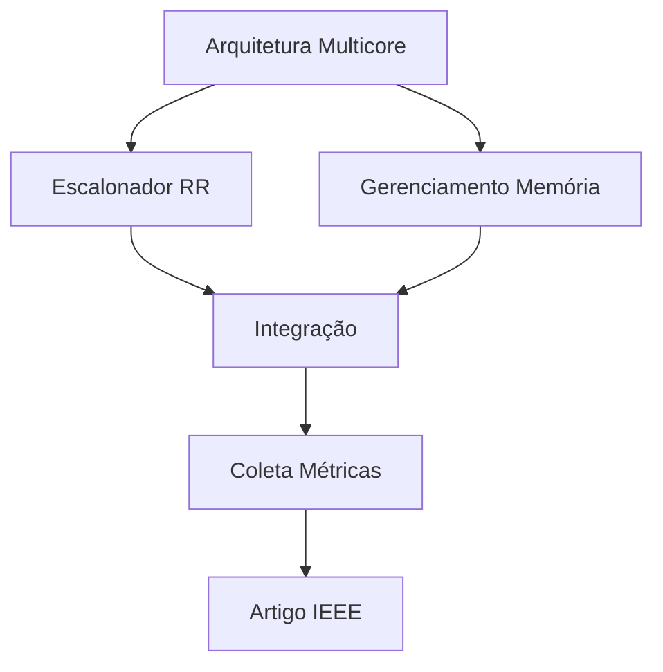

# Divisão de Tarefas

## 👥 Organização da Equipe

Este documento detalha a divisão de responsabilidades entre os membros da equipe para a implementação do simulador multicore com escalonador Round Robin.

## 🎯 Estrutura de Divisão

### Membro 1: Arquitetura Multicore e Sincronização

**Responsabilidades:**
- Implementar a classe `MultiCore` para gerenciar múltiplos núcleos
- Desenvolver mecanismos de sincronização (mutexes, semáforos)
- Criar sistema de comunicação inter-core
- Implementar barreiras de sincronização
- Gerenciar estado global do sistema

**Entregas:**
- `MultiCore.hpp` e `MultiCore.cpp`
- Documentação de APIs de sincronização
- Testes de sincronização
- Exemplos de uso

**Prazo:** Semana 1-2

---

### Membro 2: Escalonador Round Robin

**Responsabilidades:**
- Implementar `RoundRobinScheduler` multicore
- Desenvolver fila de processos prontos (global ou por núcleo)
- Implementar preempção por quantum
- Gerenciar contexto de troca de processos
- Implementar balanceamento de carga entre núcleos

**Entregas:**
- `RoundRobinScheduler.hpp` e `RoundRobinScheduler.cpp`
- Política de atribuição de processos aos núcleos
- Testes de escalonamento
- Documentação do algoritmo

**Prazo:** Semana 2-3

---

### Membro 3: Gerenciamento de Memória

**Responsabilidades:**
- Implementar segmentação de memória
- Desenvolver políticas de substituição (FIFO, LRU)
- Gerenciar tabela de segmentos
- Implementar proteção de memória entre processos
- Tratar falhas de segmento

**Entregas:**
- `SegmentationManager.hpp` e `SegmentationManager.cpp`
- Implementação de políticas LRU e FIFO
- Testes de gerenciamento de memória
- Documentação de estruturas de dados

**Prazo:** Semana 2-3

---

### Membro 4: Métricas e Artigo IEEE

**Responsabilidades:**
- Implementar sistema de coleta de métricas
- Desenvolver análise estatística dos resultados
- Criar gráficos e visualizações
- Escrever o artigo IEEE
- Revisar documentação técnica

**Entregas:**
- `MetricsCollector.hpp` e `MetricsCollector.cpp`
- Scripts de análise de dados
- Gráficos comparativos
- Artigo IEEE completo
- Apresentação de resultados

**Prazo:** Semana 3-4

---

## 📋 Tarefas Compartilhadas

Todos os membros devem contribuir com:

- ✅ **Code Review:** Revisar código dos colegas
- ✅ **Testes:** Escrever testes para suas implementações
- ✅ **Documentação:** Documentar código e decisões de design
- ✅ **Integração:** Garantir que componentes funcionem juntos
- ✅ **Reuniões:** Participar de reuniões semanais de sincronização

---

## 🗓️ Cronograma de Integração

### Semana 1
- Setup inicial do ambiente
- Definição de interfaces entre componentes
- Início da implementação individual

### Semana 2
- Primeira integração parcial
- Testes de integração básicos
- Ajustes de interface

### Semana 3
- Integração completa
- Testes de sistema
- Coleta de métricas

### Semana 4
- Refinamento e otimização
- Escrita do artigo
- Preparação da apresentação

---

## 🔄 Protocolo de Comunicação

### Reuniões Semanais
- **Segunda-feira:** Planning da semana
- **Quarta-feira:** Status update
- **Sexta-feira:** Review e retrospectiva

### Canais de Comunicação
- **Discord/WhatsApp:** Dúvidas rápidas
- **GitHub Issues:** Problemas técnicos
- **GitHub Pull Requests:** Code review
- **Google Docs:** Escrita colaborativa do artigo

---

## 📊 Critérios de Qualidade

Cada implementação deve atender:

- ✅ Compilação sem warnings
- ✅ Cobertura de testes > 80%
- ✅ Documentação inline (comentários)
- ✅ Código segue padrão C++17
- ✅ Sem memory leaks (verificado com valgrind)
- ✅ Performance adequada

---

## 🎯 Dependências Entre Tarefas

### Ordem de Implementação Recomendada:

1. **Fase 1:** Arquitetura Multicore (base para tudo)
2. **Fase 2:** Escalonador RR + Gerenciamento Memória (paralelo)
3. **Fase 3:** Integração e testes
4. **Fase 4:** Métricas e artigo

---

## 🆘 Pontos de Atenção

### Interfaces Críticas
Definir claramente as interfaces entre:
- MultiCore ↔ Scheduler
- Scheduler ↔ Memory Manager
- Core ↔ PCB
- Todos ↔ Metrics Collector

### Sincronização
Cuidado com:
- Race conditions
- Deadlocks
- Starvation
- Ordenação de operações

### Performance
Monitorar:
- Overhead de sincronização
- Balanceamento de carga
- Utilização de memória
- Tempo de resposta

---

## 📝 Checklist Individual

Cada membro deve completar:

- [ ] Implementação do componente atribuído
- [ ] Testes unitários (mínimo 10 casos)
- [ ] Testes de integração
- [ ] Documentação técnica
- [ ] Code review de pelo menos 2 PRs
- [ ] Contribuição para o artigo IEEE
- [ ] Apresentação do componente na reunião final

---

## 🏆 Avaliação por Componente

| Componente | Complexidade | Peso | Prazo |
|------------|--------------|------|-------|
| Multicore + Sync | Alta | 30% | Semana 2 |
| Escalonador RR | Alta | 30% | Semana 3 |
| Memória | Média | 20% | Semana 3 |
| Métricas + Artigo | Média | 20% | Semana 4 |

**Total:** 100% = 20 pontos (implementação) + 10 pontos (artigo) = 30 pontos

---

## 🔗 Recursos Úteis

- [Roadmap de Implementação](04-roadmap.md)
- [Cronograma Detalhado](06-cronograma.md)
- [Estratégia de Testes](12-testes.md)
- [FAQ](20-faq.md)

---

**Dica:** Mantenha comunicação constante e não hesite em pedir ajuda aos colegas!
