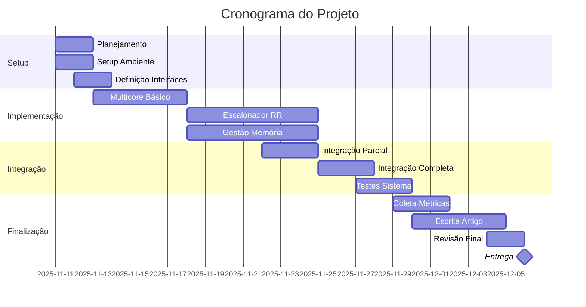

# Cronograma de Implementação

## 📅 Visão Geral

**Período Total:** 4 semanas  
**Data Início:** 11/11/2025  
**Data Entrega:** 06/12/2025

---

## 🗓️ Semana 1 (11/11 - 17/11)

### Objetivo: Fundações e Planejamento

#### Segunda-feira (11/11)
- [ ] Reunião inicial da equipe
- [ ] Revisão completa do código base
- [ ] Setup do ambiente de desenvolvimento
- [ ] Criação do repositório/branches

#### Terça-feira (12/11)
- [ ] Definição de interfaces entre componentes
- [ ] Criação de headers (.hpp) preliminares
- [ ] Setup de sistema de build (CMake/Makefile)
- [ ] Configuração de ferramentas de teste

#### Quarta-feira (13/11)
- [ ] **Membro 1:** Estrutura básica de `MultiCore.hpp`
- [ ] **Membro 2:** Estrutura básica de `RoundRobinScheduler.hpp`
- [ ] **Membro 3:** Estrutura básica de `SegmentationManager.hpp`
- [ ] **Membro 4:** Setup de ferramentas de métricas

#### Quinta-feira (14/11)
- [ ] Implementação de stubs (funções vazias)
- [ ] Primeiro build completo do projeto
- [ ] Testes de compilação

#### Sexta-feira (15/11)
- [ ] Code review coletivo
- [ ] Ajustes de interfaces
- [ ] Reunião de status
- [ ] Planejamento da Semana 2

#### Fim de Semana (16-17/11)
- [ ] Estudo de algoritmos necessários
- [ ] Leitura de referências bibliográficas
- [ ] Preparação para implementação

**Entregável:** Estrutura básica compilando + Interfaces definidas

---

## 🗓️ Semana 2 (18/11 - 24/11)

### Objetivo: Implementação dos Componentes Principais

#### Segunda-feira (18/11)
- [ ] **Membro 1:** Implementar criação de múltiplos cores
- [ ] **Membro 1:** Sistema básico de mutexes
- [ ] **Membro 2:** Fila de processos prontos
- [ ] **Membro 3:** Estrutura de tabela de segmentos
- [ ] **Membro 4:** Framework de coleta de métricas

#### Terça-feira (19/11)
- [ ] **Membro 1:** Comunicação inter-core básica
- [ ] **Membro 2:** Lógica de atribuição de processos
- [ ] **Membro 3:** Alocação de segmentos
- [ ] **Membro 4:** Métricas de CPU

#### Quarta-feira (20/11)
- [ ] **Membro 1:** Barreiras de sincronização
- [ ] **Membro 2:** Implementar quantum e preempção
- [ ] **Membro 3:** Implementar política FIFO
- [ ] **Membro 4:** Métricas de memória
- [ ] Reunião de integração

#### Quinta-feira (21/11)
- [ ] **Membro 1:** Testes de sincronização
- [ ] **Membro 2:** Testes de escalonamento
- [ ] **Membro 3:** Testes de alocação
- [ ] **Membro 4:** Testes de métricas

#### Sexta-feira (22/11)
- [ ] Primeira integração entre componentes
- [ ] Debug de problemas de integração
- [ ] Code review
- [ ] Reunião de status

#### Fim de Semana (23-24/11)
- [ ] Correção de bugs identificados
- [ ] Refinamento de implementações
- [ ] Testes adicionais

**Entregável:** Componentes individuais funcionando + Primeira integração

---

## 🗓️ Semana 3 (25/11 - 01/12)

### Objetivo: Integração Completa e Otimização

#### Segunda-feira (25/11)
- [ ] **Membro 1:** Finalizar sincronização avançada
- [ ] **Membro 2:** Implementar balanceamento de carga
- [ ] **Membro 3:** Implementar política LRU
- [ ] **Membro 4:** Estrutura inicial do artigo IEEE

#### Terça-feira (26/11)
- [ ] **Membro 2:** Otimizar troca de contexto
- [ ] **Membro 3:** Proteção de memória entre processos
- [ ] **Todos:** Integração completa do sistema
- [ ] Testes de sistema básicos

#### Quarta-feira (27/11)
- [ ] Testes de carga e stress
- [ ] Identificação de gargalos
- [ ] Profiling de performance
- [ ] Reunião de análise

#### Quinta-feira (28/11)
- [ ] Otimizações de performance
- [ ] Correção de race conditions
- [ ] Testes de concorrência
- [ ] Validação de deadlocks

#### Sexta-feira (29/11)
- [ ] **Membro 4:** Coleta de dados para artigo
- [ ] Execução de benchmarks
- [ ] Geração de gráficos
- [ ] Code review final

#### Fim de Semana (30/11 - 01/12)
- [ ] **Membro 4:** Escrita do artigo (seções técnicas)
- [ ] Preparação de resultados
- [ ] Refinamento de gráficos

**Entregável:** Sistema completo funcionando + Dados coletados

---

## 🗓️ Semana 4 (02/12 - 06/12)

### Objetivo: Finalização e Documentação

#### Segunda-feira (02/12)
- [ ] **Membro 4:** Escrita do artigo (Introdução e Metodologia)
- [ ] Documentação técnica completa
- [ ] README atualizado
- [ ] Comentários no código

#### Terça-feira (03/12)
- [ ] **Membro 4:** Escrita do artigo (Resultados e Discussão)
- [ ] Testes finais de validação
- [ ] Verificação de requisitos
- [ ] Checklist de entrega

#### Quarta-feira (04/12)
- [ ] **Membro 4:** Escrita do artigo (Conclusão e Referências)
- [ ] Revisão geral do código
- [ ] Testes de regressão
- [ ] Preparação de demo

#### Quinta-feira (05/12)
- [ ] **Todos:** Revisão colaborativa do artigo
- [ ] Formatação IEEE final
- [ ] Verificação de plágio
- [ ] Preparação da apresentação
- [ ] Build final e empacotamento

#### Sexta-feira (06/12)
- [ ] **Entrega final do trabalho** 🎯
- [ ] Upload do código
- [ ] Submissão do artigo
- [ ] Entrega de documentação

**Entregável:** Trabalho completo + Artigo IEEE + Apresentação

---

## 📊 Marcos (Milestones)

| Marco | Data | Critério de Sucesso |
|-------|------|---------------------|
| M1: Setup Completo | 15/11 | Projeto compila, interfaces definidas |
| M2: Componentes Individuais | 22/11 | Cada componente funciona isoladamente |
| M3: Integração Básica | 27/11 | Sistema executa processos em multicore |
| M4: Sistema Completo | 01/12 | Todas funcionalidades implementadas |
| M5: Artigo Draft | 03/12 | Primeira versão completa do artigo |
| M6: Entrega Final | 06/12 | Tudo pronto e testado |

---

## ⚠️ Pontos de Atenção

### Riscos Identificados

1. **Risco Alto:** Problemas de sincronização
   - **Mitigação:** Começar cedo, testes extensivos
   - **Contingência:** Simplificar arquitetura se necessário

2. **Risco Médio:** Integração complexa
   - **Mitigação:** Integração incremental desde Semana 2
   - **Contingência:** Buffer de 2 dias na Semana 3

3. **Risco Baixo:** Escrita do artigo
   - **Mitigação:** Começar na Semana 3
   - **Contingência:** Escrita colaborativa se necessário

---

## 🎯 Checklist de Prontidão para Entrega

### Código
- [ ] Compila sem warnings
- [ ] Todos os testes passam
- [ ] Sem memory leaks (valgrind)
- [ ] Código comentado
- [ ] README.md atualizado

### Funcionalidades
- [ ] Multicore funcional (mínimo 2 cores)
- [ ] Round Robin com preempção
- [ ] Gerenciamento de memória segmentada
- [ ] Políticas FIFO e LRU
- [ ] Coleta de métricas
- [ ] Comparação single vs multicore

### Artigo IEEE
- [ ] Formato IEEE correto
- [ ] 6-8 páginas
- [ ] Gráficos e tabelas
- [ ] Referências bibliográficas
- [ ] Abstract e Keywords
- [ ] Revisão ortográfica

### Documentação
- [ ] Comentários inline
- [ ] Diagramas de arquitetura
- [ ] Guia de compilação
- [ ] Guia de execução
- [ ] Análise de resultados

---

## 📈 Gráfico de Gantt

---

## 🔗 Recursos Relacionados

- [Divisão de Tarefas](05-divisao-tarefas.md)
- [Roadmap de Implementação](04-roadmap.md)
- [Estratégia de Testes](12-testes.md)

---

**Nota:** Este cronograma é uma sugestão. Ajuste conforme necessário baseado no progresso real da equipe.
