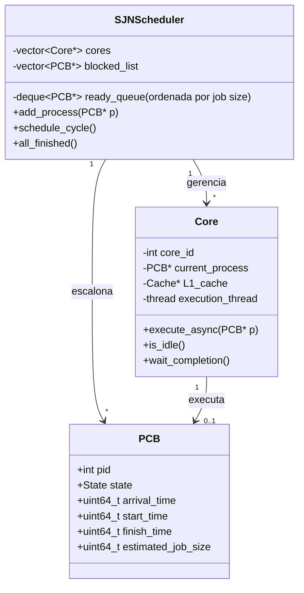

# Implementação do Escalonador SJN (Shortest Job Next)

## 🎯 Objetivo

Implementar um escalonador SJN **multicore** que sempre seleciona para execução o processo com menor tempo estimado de serviço restante.

## 📚 Fundamentos Teóricos

### O que é SJN?

SJN (Shortest Job Next) é um algoritmo de escalonamento **não-preemptivo** onde:

1. Todos os processos do lote inicial são carregados na memória antes da execução.
2. Cada núcleo pega o processo com menor tempo estimado de execução (job mais curto) da fila de prontos.
3. O processo é executado até terminar ou bloquear por I/O.
4. Quando um núcleo fica livre, pega o próximo processo mais curto disponível.

### Fórmulas Importantes

**Tempo de Espera:**
$$W_i = T_{retorno,i} - T_{execução,i}$$

**Tempo de Retorno (Turnaround):**
$$T_{retorno,i} = T_{término,i} - T_{chegada,i}$$

**Tempo Médio de Espera:**
$$\bar{W} = \frac{1}{n}\sum_{i=1}^{n} W_i$$

**Throughput:**
$$Throughput = \frac{n_{processos}}{T_{total}}$$

### SJN em Multicore

Em um sistema multicore, o SJN distribui múltiplos processos entre múltiplos núcleos, sempre priorizando o job mais curto:

```
┌─────────────────────────────────────┐
│   Fila Global de Prontos (ordenada) │
│   [ P2 ] [ P1 ] [ P3 ] [ P4 ] ...   │
└────────┬────────┬────────┬──────────┘
         │        │        │
    ┌────▼───┐┌──▼────┐┌──▼────┐
    │ Core 0 ││Core 1 ││Core 2 │
    └────────┘└───────┘└──────┘
```

**Vantagens:**
- ✅ Minimiza tempo médio de espera
- ✅ Favorece jobs curtos
- ✅ Reduz turnaround

**Desvantagens:**
- ❌ Jobs longos podem esperar muito
- ❌ Precisa estimar tempo de execução

## 🏗️ Arquitetura da Solução

### Diagrama de Classes



## 📝 Implementação Passo a Passo

### Passo 1: Estrutura Básica do Escalonador

**Arquivo:** `src/cpu/SJNScheduler.hpp`

```cpp
#pragma once
#include <vector>
#include <deque>
#include <memory>
#include "PCB.hpp"
#include "Core.hpp"
#include "IOManager.hpp"
#include "memory/MemoryManager.hpp"

class SJNScheduler {
public:
    SJNScheduler(int num_cores, MemoryManager* memManager, IOManager* ioManager);
    void add_process(PCB* process);
    void schedule_cycle();
    bool all_finished() const;
    std::vector<std::unique_ptr<Core>>& get_cores();
    std::deque<PCB*>& get_ready_queue();
    std::vector<PCB*>& get_blocked_list();
private:
    int num_cores;
    MemoryManager* memManager;
    IOManager* ioManager;
    std::vector<std::unique_ptr<Core>> cores;
    std::deque<PCB*> ready_queue;
    std::vector<PCB*> blocked_list;
};
```

### Passo 2: Implementação do Construtor

**Arquivo:** `src/cpu/SJNScheduler.cpp`

```cpp
#include "SJNScheduler.hpp"
#include <iostream>
#include <algorithm>

SJNScheduler::SJNScheduler(int num_cores, MemoryManager* memManager, IOManager* ioManager)
    : num_cores(num_cores), memManager(memManager), ioManager(ioManager) {
    for (int i = 0; i < num_cores; i++) {
        cores.push_back(std::make_unique<Core>(i, memManager));
    }
}
```

### Passo 3: Adicionar Processo à Fila (ordenada)

```cpp
void SJNScheduler::add_process(PCB* process) {
    // Insere na fila ordenada por estimated_job_size
    auto it = std::find_if(ready_queue.begin(), ready_queue.end(),
        [&](PCB* p) { return process->estimated_job_size < p->estimated_job_size; });
    ready_queue.insert(it, process);
}
```

### Passo 4: Ciclo Principal de Escalonamento

```cpp
void SJNScheduler::schedule_cycle() {
    // Desbloqueia processos do IO
    for (auto it = blocked_list.begin(); it != blocked_list.end(); ) {
        if ((*it)->state == State::Ready) {
            // Reinsere na fila ordenada
            add_process(*it);
            it = blocked_list.erase(it);
        } else {
            ++it;
        }
    }
    // Atribui processos aos núcleos livres
    for (auto& core : cores) {
        if (core->is_idle() && !ready_queue.empty()) {
            PCB* process = ready_queue.front();
            ready_queue.pop_front();
            core->execute_async(process);
        }
    }
    // Coleta processos finalizados ou bloqueados
    for (auto& core : cores) {
        if (!core->is_idle() && !core->is_thread_running()) {
            PCB* process = core->get_current_process();
            if (process) {
                core->wait_completion();
                switch (process->state) {
                    case State::Finished:
                        break;
                    case State::Blocked:
                        ioManager->registerProcessWaitingForIO(process);
                        blocked_list.push_back(process);
                        break;
                    default:
                        add_process(process);
                        break;
                }
            }
        }
    }
}
```

### Passo 5: Verificar Fim da Execução

```cpp
bool SJNScheduler::all_finished() const {
    for (const auto& core : cores) {
        if (!core->is_idle()) return false;
    }
    return ready_queue.empty() && blocked_list.empty();
}
```

## 🧪 Testando o Escalonador

### Teste: Múltiplos Processos, Múltiplos Núcleos

**Cenário:**
- 3 processos (P1: 50 ciclos, P2: 200 ciclos, P3: 100 ciclos)
- 2 núcleos
- Todos carregados antes da execução

**Execução Esperada:**
- Núcleos pegam sempre o processo mais curto disponível
- Jobs curtos terminam primeiro
- Jobs longos podem esperar mais

**Como usar:**
```bash
./simulador --policy SJN \
    -p test_programs/p1.json test_programs/pcb_p1.json \
    -p test_programs/p2.json test_programs/pcb_p2.json \
    -p test_programs/p3.json test_programs/pcb_p3.json
```

## 📊 Métricas Coletadas

- Tempo de espera
- Tempo de retorno
- Utilização da CPU
- Throughput

## 🐛 Problemas Comuns e Soluções

- **Jobs longos podem esperar muito**
- **Necessário estimar corretamente o job size**
- **Serve para comparar com FCFS e RR**

## 📖 Próximos Passos

➡️ [**Implementação do FCFS**](09-fcfs.md)
➡️ [**Implementação do Round Robin**](08-round-robin.md)
➡️ [**Gerenciamento de Memória Segmentada**](09-memoria.md)
