# Estratégia de Testes

## 🎯 Objetivo

Estabelecer uma estratégia completa de testes para garantir correção, confiabilidade e desempenho do simulador multicore.

---

## 🏗️ Pirâmide de Testes

```mermaid
graph TD
    A[Testes de Sistema] --> B[Testes de Integração]
    B --> C[Testes Unitários]
    C --> D[Base: Código]
```



### Níveis de Teste

| Nível | Quantidade | Escopo | Velocidade |
|-------|------------|--------|------------|
| **Unitários** | 70% | Funções individuais | Rápido |
| **Integração** | 20% | Componentes juntos | Médio |
| **Sistema** | 10% | Sistema completo | Lento |

---

## 🧪 Testes Unitários

### 1. Testes de Core

```cpp
// test_core.cpp
#include "gtest/gtest.h"
#include "Core.hpp"

class CoreTest : public ::testing::Test {
protected:
    void SetUp() override {
        core = std::make_unique<Core>(0);
    }
    
    std::unique_ptr<Core> core;
};

TEST_F(CoreTest, Initialization) {
    EXPECT_EQ(core->getCoreId(), 0);
    EXPECT_FALSE(core->isBusy());
}

TEST_F(CoreTest, ProcessExecution) {
    auto process = std::make_shared<PCB>();
    process->pid = 1;
    process->burst_time = 100;
    
    core->assignProcess(process);
    EXPECT_TRUE(core->isBusy());
    
    core->executeOneCycle();
    EXPECT_GT(core->getCyclesExecuted(), 0);
}

TEST_F(CoreTest, ContextSwitch) {
    auto process1 = std::make_shared<PCB>();
    process1->pid = 1;
    
    auto process2 = std::make_shared<PCB>();
    process2->pid = 2;
    
    core->assignProcess(process1);
    core->contextSwitch(process2);
    
    EXPECT_EQ(core->getCurrentProcess()->pid, 2);
}
```

---

### 2. Testes de Scheduler

```cpp
// test_scheduler.cpp
#include "gtest/gtest.h"
#include "RoundRobinScheduler.hpp"

class SchedulerTest : public ::testing::Test {
protected:
    void SetUp() override {
        scheduler = std::make_unique<RoundRobinScheduler>(4, 10);
    }
    
    std::unique_ptr<RoundRobinScheduler> scheduler;
};

TEST_F(SchedulerTest, AddProcess) {
    auto process = std::make_shared<PCB>();
    process->pid = 1;
    
    scheduler->addProcess(process);
    EXPECT_EQ(scheduler->getQueueSize(), 1);
}

TEST_F(SchedulerTest, RoundRobinOrder) {
    // Adicionar 3 processos
    for (int i = 0; i < 3; i++) {
        auto process = std::make_shared<PCB>();
        process->pid = i;
        scheduler->addProcess(process);
    }
    
    // Verificar ordem Round Robin
    auto p1 = scheduler->getNextProcess(0);
    EXPECT_EQ(p1->pid, 0);
    
    scheduler->addProcess(p1); // Retornar à fila
    
    auto p2 = scheduler->getNextProcess(0);
    EXPECT_EQ(p2->pid, 1);
}

TEST_F(SchedulerTest, LoadBalancing) {
    // Adicionar muitos processos
    for (int i = 0; i < 20; i++) {
        auto process = std::make_shared<PCB>();
        process->pid = i;
        scheduler->addProcess(process);
    }
    
    // Verificar distribuição entre cores
    std::vector<int> core_counts(4, 0);
    for (int i = 0; i < 20; i++) {
        auto process = scheduler->getNextProcess(i % 4);
        if (process) {
            core_counts[process->assigned_core]++;
        }
    }
    
    // Todos os cores devem ter processos
    for (int count : core_counts) {
        EXPECT_GT(count, 0);
    }
}
```

---

### 3. Testes de Memória

```cpp
// test_memory.cpp
#include "gtest/gtest.h"
#include "SegmentationManager.hpp"

class MemoryTest : public ::testing::Test {
protected:
    void SetUp() override {
        manager = std::make_unique<SegmentationManager>(
            1024 * 1024, LRU_POLICY);
    }
    
    std::unique_ptr<SegmentationManager> manager;
};

TEST_F(MemoryTest, SegmentAllocation) {
    manager->createProcessTable(1);
    
    bool success = manager->allocateSegment(1, CODE, 4096);
    EXPECT_TRUE(success);
}

TEST_F(MemoryTest, MemoryLimit) {
    manager->createProcessTable(1);
    
    // Tentar alocar mais que a memória disponível
    bool success = manager->allocateSegment(1, CODE, 2 * 1024 * 1024);
    EXPECT_FALSE(success);
}

TEST_F(MemoryTest, LRUPolicy) {
    manager->createProcessTable(1);
    
    // Alocar segmentos
    manager->allocateSegment(1, CODE, 256 * 1024);
    manager->allocateSegment(1, DATA, 256 * 1024);
    manager->allocateSegment(1, STACK, 256 * 1024);
    
    // Acessar em ordem específica
    manager->accessSegment(1, 0, 0); // Seg 0
    manager->accessSegment(1, 1, 0); // Seg 1
    manager->accessSegment(1, 0, 0); // Seg 0 novamente
    
    // Alocar mais um grande (deve remover Seg 1)
    manager->allocateSegment(1, HEAP, 512 * 1024);
    
    // Verificar que Seg 0 ainda está em memória
    auto segment = manager->accessSegment(1, 0, 0);
    EXPECT_TRUE(segment->in_memory);
}

TEST_F(MemoryTest, SegmentationFault) {
    manager->createProcessTable(1);
    manager->allocateSegment(1, CODE, 4096);
    
    // Tentar acessar offset inválido
    EXPECT_THROW(
        manager->accessSegment(1, 0, 10000),
        std::runtime_error
    );
}
```

---

## 🔗 Testes de Integração

### 1. Teste Multicore + Scheduler

```cpp
// test_multicore_scheduler.cpp
TEST(IntegrationTest, MulticoreWithScheduler) {
    MultiCore system(2);
    system.initialize();
    
    // Adicionar processos
    for (int i = 0; i < 10; i++) {
        auto process = std::make_shared<PCB>();
        process->pid = i;
        process->burst_time = 100;
        system.addProcess(process);
    }
    
    // Executar
    system.start();
    std::this_thread::sleep_for(std::chrono::seconds(5));
    system.stop();
    
    // Verificar que todos completaram
    auto metrics = system.getMetrics();
    int total_completed = 0;
    for (const auto& metric : metrics) {
        total_completed += metric.processes_executed;
    }
    
    EXPECT_EQ(total_completed, 10);
}
```

---

### 2. Teste Scheduler + Memória

```cpp
TEST(IntegrationTest, SchedulerWithMemory) {
    auto scheduler = std::make_unique<RoundRobinScheduler>(2, 10);
    auto memory = std::make_unique<SegmentationManager>(
        1024 * 1024, FIFO_POLICY);
    
    // Criar processos com segmentos
    for (int i = 0; i < 5; i++) {
        auto process = std::make_shared<PCB>();
        process->pid = i;
        
        memory->createProcessTable(i);
        memory->allocateSegment(i, CODE, 4096);
        memory->allocateSegment(i, DATA, 8192);
        
        scheduler->addProcess(process);
    }
    
    // Executar escalonamento e acesso à memória
    for (int i = 0; i < 5; i++) {
        auto process = scheduler->getNextProcess(0);
        ASSERT_NE(process, nullptr);
        
        // Acessar memória do processo
        auto segment = memory->accessSegment(process->pid, 0, 0);
        EXPECT_NE(segment, nullptr);
        
        scheduler->addProcess(process);
    }
}
```

---

## 🎭 Testes de Sistema

### 1. Teste End-to-End

```cpp
// test_system.cpp
TEST(SystemTest, FullSimulation) {
    // Configurar sistema completo
    MultiCore system(4);
    system.initialize();
    
    // Carregar processos de arquivo
    std::vector<std::shared_ptr<PCB>> processes = 
        loadProcessesFromJSON("test_processes.json");
    
    for (auto& process : processes) {
        system.addProcess(process);
    }
    
    // Executar simulação
    system.start();
    
    // Aguardar conclusão
    while (system.hasRunningProcesses()) {
        std::this_thread::sleep_for(std::chrono::milliseconds(100));
    }
    
    system.stop();
    
    // Verificar resultados
    auto metrics = system.getMetrics();
    EXPECT_GT(metrics.size(), 0);
    
    // Verificar métricas
    double total_utilization = 0;
    for (const auto& metric : metrics) {
        total_utilization += metric.utilization;
        EXPECT_GE(metric.utilization, 0.0);
        EXPECT_LE(metric.utilization, 100.0);
    }
    
    double avg_utilization = total_utilization / metrics.size();
    EXPECT_GT(avg_utilization, 50.0); // Pelo menos 50% de uso
}
```

---

### 2. Teste de Stress

```cpp
TEST(SystemTest, StressTest) {
    MultiCore system(8);
    system.initialize();
    
    // Adicionar muitos processos
    const int NUM_PROCESSES = 1000;
    for (int i = 0; i < NUM_PROCESSES; i++) {
        auto process = std::make_shared<PCB>();
        process->pid = i;
        process->burst_time = 50 + (rand() % 200);
        system.addProcess(process);
    }
    
    // Executar
    auto start = std::chrono::high_resolution_clock::now();
    system.start();
    
    while (system.hasRunningProcesses()) {
        std::this_thread::sleep_for(std::chrono::milliseconds(10));
    }
    
    auto end = std::chrono::high_resolution_clock::now();
    system.stop();
    
    auto duration = std::chrono::duration_cast<std::chrono::seconds>(
        end - start).count();
    
    std::cout << "Processed " << NUM_PROCESSES 
              << " processes in " << duration << " seconds\n";
    
    // Verificar que não travou
    EXPECT_LT(duration, 300); // Menos de 5 minutos
}
```

---

## 🐛 Testes de Concorrência

### 1. Teste de Race Condition

```cpp
TEST(ConcurrencyTest, NoRaceCondition) {
    std::atomic<int> counter{0};
    const int NUM_THREADS = 10;
    const int INCREMENTS_PER_THREAD = 10000;
    
    std::vector<std::thread> threads;
    
    for (int i = 0; i < NUM_THREADS; i++) {
        threads.emplace_back([&counter]() {
            for (int j = 0; j < INCREMENTS_PER_THREAD; j++) {
                counter.fetch_add(1, std::memory_order_relaxed);
            }
        });
    }
    
    for (auto& thread : threads) {
        thread.join();
    }
    
    EXPECT_EQ(counter.load(), NUM_THREADS * INCREMENTS_PER_THREAD);
}
```

---

### 2. Teste de Deadlock

```cpp
TEST(ConcurrencyTest, NoDeadlock) {
    MultiCore system(4);
    system.initialize();
    
    // Adicionar processos que podem causar contenção
    for (int i = 0; i < 20; i++) {
        auto process = std::make_shared<PCB>();
        process->pid = i;
        process->burst_time = 100;
        system.addProcess(process);
    }
    
    // Executar com timeout
    system.start();
    
    bool completed = false;
    std::thread timeout_thread([&completed, &system]() {
        std::this_thread::sleep_for(std::chrono::seconds(10));
        if (!completed) {
            std::cerr << "Deadlock detected!\n";
            system.stop();
            FAIL() << "System deadlocked";
        }
    });
    
    while (system.hasRunningProcesses()) {
        std::this_thread::sleep_for(std::chrono::milliseconds(100));
    }
    
    completed = true;
    system.stop();
    timeout_thread.join();
    
    SUCCEED();
}
```

---

## 📊 Testes de Performance

### 1. Benchmark de Throughput

```cpp
TEST(PerformanceTest, Throughput) {
    std::vector<int> core_counts = {1, 2, 4, 8};
    std::vector<double> throughputs;
    
    for (int cores : core_counts) {
        MultiCore system(cores);
        system.initialize();
        
        // Adicionar processos fixos
        for (int i = 0; i < 100; i++) {
            auto process = std::make_shared<PCB>();
            process->pid = i;
            process->burst_time = 100;
            system.addProcess(process);
        }
        
        auto start = std::chrono::high_resolution_clock::now();
        system.start();
        
        while (system.hasRunningProcesses()) {
            std::this_thread::sleep_for(std::chrono::milliseconds(10));
        }
        
        auto end = std::chrono::high_resolution_clock::now();
        system.stop();
        
        auto duration = std::chrono::duration_cast<std::chrono::milliseconds>(
            end - start).count();
        
        double throughput = 100.0 / (duration / 1000.0);
        throughputs.push_back(throughput);
        
        std::cout << cores << " cores: " << throughput << " proc/s\n";
    }
    
    // Verificar que throughput aumenta com mais cores
    for (size_t i = 1; i < throughputs.size(); i++) {
        EXPECT_GT(throughputs[i], throughputs[i-1]);
    }
}
```

---

## 🔧 Configuração de Testes

### CMakeLists.txt

```cmake
# CMakeLists.txt
cmake_minimum_required(VERSION 3.14)
project(SimuladorTests)

set(CMAKE_CXX_STANDARD 17)

# Google Test
include(FetchContent)
FetchContent_Declare(
  googletest
  URL https://github.com/google/googletest/archive/release-1.11.0.zip
)
FetchContent_MakeAvailable(googletest)

enable_testing()

# Testes unitários
add_executable(unit_tests
    test/test_core.cpp
    test/test_scheduler.cpp
    test/test_memory.cpp
)

target_link_libraries(unit_tests
    gtest_main
    pthread
)

# Testes de integração
add_executable(integration_tests
    test/test_integration.cpp
)

target_link_libraries(integration_tests
    gtest_main
    pthread
)

# Registrar testes
include(GoogleTest)
gtest_discover_tests(unit_tests)
gtest_discover_tests(integration_tests)
```

---

## 🚀 Execução de Testes

### Makefile

```makefile
.PHONY: test test-unit test-integration test-coverage

test: test-unit test-integration

test-unit:
	@echo "Running unit tests..."
	./build/unit_tests --gtest_color=yes

test-integration:
	@echo "Running integration tests..."
	./build/integration_tests --gtest_color=yes

test-coverage:
	@echo "Running tests with coverage..."
	g++ -coverage -fprofile-arcs -ftest-coverage \
		test/*.cpp src/*.cpp -o test_coverage
	./test_coverage
	gcov test/*.cpp
	lcov --capture --directory . --output-file coverage.info
	genhtml coverage.info --output-directory coverage_report
```

---

## 📝 Checklist de Testes

### Antes da Entrega

- [ ] Todos os testes unitários passam
- [ ] Testes de integração passam
- [ ] Testes de sistema passam
- [ ] Sem memory leaks (valgrind)
- [ ] Sem race conditions (ThreadSanitizer)
- [ ] Cobertura de código > 80%
- [ ] Testes de performance executados
- [ ] Benchmarks documentados

---

## 🔗 Ferramentas

### Valgrind (Memory Leaks)
```bash
valgrind --leak-check=full ./simulador
```

### ThreadSanitizer (Race Conditions)
```bash
g++ -fsanitize=thread -g -o simulador main.cpp
./simulador
```

### AddressSanitizer (Memory Errors)
```bash
g++ -fsanitize=address -g -o simulador main.cpp
./simulador
```

---

## 📚 Referências

- Google Test Documentation
- FREEMAN, S. Growing Object-Oriented Software, Guided by Tests
- BECK, K. Test Driven Development

---

## 🔗 Próximos Passos

- ➡️ [Casos de Teste](13-casos-teste.md)
- ➡️ [Debugging](14-debugging.md)
